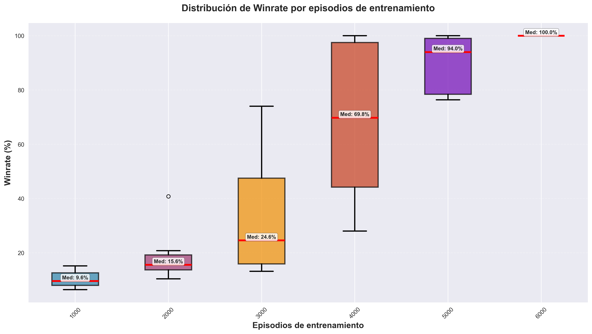

# Representación de estados basada en características para agente Q-Learning

## Resumen

Este documento presenta una modificación al algoritmo Q-Learning mediante la implementación de una representación de estados basada en características (*feature-based*) para mejorar el desempeño del agente en NetSecGame. La propuesta aborda las limitaciones del mapeo directo estado-identificador, introduciendo una abstracción que permite la generalización entre estados similares y reduce la complejidad del espacio de estados.

## 1. Introducción

### 1.2 Hipótesis de trabajo

Se postula que la implementación de una representación basada en características permitirá al agente Q-Learning:
- Generalizar el conocimiento adquirido entre estados funcionalmente equivalentes
- Reducir el tiempo de convergencia del algoritmo
- Mantener o mejorar la calidad de las políticas aprendidas

## 2. Metodología

### 2.1 Arquitectura propuesta

La solución implementada consta de dos componentes principales:

#### 2.1.1 Extractor de características (*FeatureExtractor*)

Módulo encargado de transformar la representación textual compleja del estado del entorno en un vector de características numéricas de dimensión fija.

```python
class FeatureExtractor:
    def extract_features(self, state_str: str) -> np.array:
        # Extracción y cuantificación de características del estado
        return np.array([num_networks, num_known_hosts, num_controlled_hosts, 
                        total_services, total_data])
```

#### 2.1.2 Agente Q-Learning modificado

Implementación que utiliza el vector de características como identificador de estado, reemplazando el mapeo directo tradicional.

**Implementación base de algoritmo Q-Learning previo:**
```python
def get_state_id(self, state: GameState) -> int:
    state_str = state_as_ordered_string(state)
    if state_str not in self._str_to_id:
        self._str_to_id[state_str] = len(self._str_to_id)
    return self._str_to_id[state_str]
```

**Implementación propuesta:**
```python
def get_state_id(self, state: GameState) -> tuple:
    state_str = state_as_ordered_string(state)
    features = self.feature_extractor.extract_features(state_str)
    return tuple(int(x) for x in features)
```

### 2.2 Espacio de características

El vector de características definido captura cinco dimensiones fundamentales del estado del entorno:

$$\mathbf{f}(s) = [n_{redes}, n_{hosts\_conocidos}, n_{hosts\_controlados}, n_{servicios}, n_{datos}]$$

Donde:
- $n_{redes}$: Cantidad de subredes descubiertas
- $n_{hosts\_conocidos}$: Total de hosts identificados en el entorno  
- $n_{hosts\_controlados}$: Número de hosts bajo control del atacante
- $n_{servicios}$: Suma de servicios detectados en todos los hosts
- $n_{datos}$: Total de elementos de datos encontrados

### 2.3 Caso de estudio

**Estado del entorno ejemplo:**
```
    """
    nets:[192.168.1.0/24,192.168.2.0/24,192.168.3.0/24,213.47.23.192/26],
    hosts:[192.168.1.2,192.168.1.3,192.168.1.4,192.168.2.1,192.168.2.2,192.168.2.3,192.168.2.4,192.168.2.5,192.168.2.6,213.47.23.195],
    controlled:[192.168.2.2,192.168.2.4,192.168.2.6,213.47.23.195],
    services:{192.168.1.3:[Service(name='postgresql', type='passive', version='14.3.0', is_local=False),Service(name='ssh', type='passive', version='8.1.0', is_local=False)]192.168.2.2:[Service(name='ms-wbt-server', type='passive', version='10.0.19041', is_local=False)]192.168.2.3:[Service(name='ms-wbt-server', type='passive', version='10.0.19041', is_local=False)]192.168.2.4:[Service(name='bash', type='passive', version='5.0.0', is_local=True),Service(name='ssh', type='passive', version='8.1.0', is_local=False)]192.168.2.5:[Service(name='ssh', type='passive', version='8.1.0', is_local=False)]192.168.2.6:[Service(name='bash', type='passive', version='5.0.0', is_local=True)]213.47.23.195:[Service(name='bash', type='passive', version='5.0.0', is_local=True),Service(name='listener', type='passive', version='1.0.0', is_local=False)]},
    data:{192.168.2.2:[Data(owner='system', id='logfile', size=439, type='log')]192.168.2.4:[Data(owner='system', id='logfile', size=439, type='log')]213.47.23.195:[Data(owner='system', id='logfile', size=676, type='log')]},
    blocks:{}
    """
```

**Vector resultante:**
$$\mathbf{f}(s) = [4, 10, 4, 10, 3]$$

## 3. Resultados experimentales

### 3.1 Configuración experimental

El agente fue entrenado con los parametros por default durante 15.000 episodios.

**Comando de ejecucion del entorno** 

```bash
docker run -it --rm ` -v ${PWD}/AIDojoCoordinator/netsecenv_conf.yaml:/aidojo/netsecenv_conf.yaml ` -v ${PWD}/logs:/aidojo/logs  -p 9000:9000 aidojo-nsg-coordinator:latest
```

**Comando de ejecución de q_agent_feature_based**

```bash
python q_agent_feature_based.py --episodes 15000 
```

### 3.2 Análisis de la implementación

**Resultados de training**

Se realizaron 10 ejecuciones independientes del algoritmo utilizando la configuracion del entorno [netsecenv_conf.yaml](#netsecenv_confyaml). Tras ello se recopilo todos los resultados obtenidos y se graficó la distribucion a traves de un grafico de cajas (ver Figura 2). 


*Figura 2: Distribución de winrate por episodios de entrenamiento en base a 10 ejecuciones. Los boxplots muestran la mediana (línea roja) y cuartiles.*

Se seleccionó un modelo `.pickle` y se procedio a realizar los siguientes experimentos: 
- Testear el modelo con la misma configuracion de entorno que en entrenamiento con direcciones IP y topologia de red fijas.
- Testear el modelo modificando aleatoriamente las direcciones IP al inicio de cada episodio.

#### 3.2.1 Experimento 1: Entorno estático

**Configuración**: Direcciones IP y topología de red fijas durante todos los episodios.

**Resultados de testing**:

     QAgent INFO Final model performance after 15000 episodes.
                Wins=15000,
                Detections=0,
                winrate=100.000%,
                detection_rate=0.000%,
                average_returns=1000.000 +- 0.000,
                average_episode_steps=5.000 +- 0.000,
                average_win_steps=5.000 +- 0.000,
                average_detected_steps=nan +- nan
                average_max_steps_steps=nan +- nan,
                epsilon=0.9


Tras ejecutar pruebas de testing con el modelo entrenado, se reconoció que todos los episodios de test terminan en exactamente 5 pasos con reward 1000. Obteniendo así un win_rate de 100% tras 15.000 episodios.

**Observación crítica**: El análisis de los logs reveló que la tabla Q resultante contenía **261.164 estados únicos**, indicando que cada combinación específica de conteos genera un estado diferente. Este comportamiento sugiere que el agente está memorizando configuraciones específicas en lugar de aprender patrones generalizables.

#### 3.2.2 Experimento 2: Entorno dinámico

**Configuración**: Activación del parámetro `use_dynamic_addresses` para modificar aleatoriamente las direcciones IP al inicio de cada episodio. Configuracion de entorno: [netsecenv_conf_dyn.yaml](#netsecenv_conf_dynyaml)

**Resultados de testing con use_dynamic_addresses**:
```
Final model performance after 15000 episodes.
                Wins=814,
                Detections=0,
                winrate=5.427%,
                detection_rate=0.000%,
                average_returns=-40.307 +- 249.197,
                average_episode_steps=98.426 +- 8.136,
                average_win_steps=70.988 +- 20.582,
                average_detected_steps=nan +- nan
                average_max_steps_steps=0.000 +- 0.000,
                epsilon=0.9
```

### 3.3 Interpretación de resultados

Los resultados experimentales revelan una **limitación fundamental** en la representación de características propuesta:

1. **Sobreespecificación**: El vector de características mantiene un nivel de granularidad que impide la generalización efectiva.

2. **Memorización vs. aprendizaje**: El desempeño perfecto en el entorno estático, contrastado con el bajo desempeño en el entorno dinámico, confirma que el agente está memorizando configuraciones específicas.

---

## Anexos

### netsecenv_conf.yaml

```python
# Configuration file for the NetSecGame environment

coordinator:
  # Define the conf for all the 'attacker' agents.
  agents:
    Attacker:
      max_steps: 100
      goal:
        description: "Exfiltrate data to '213.47.23.195'"
        is_any_part_of_goal_random: True
        known_networks: []
        #known_networks: [192.168.1.0/24, 192.168.3.0/24]
        known_hosts: []
        #known_hosts: [192.168.1.1, 192.168.1.2]
        controlled_hosts: []
        #controlled_hosts: [213.47.23.195, 192.168.1.3]
        # Services are defined as a target host where the service must be, and then a description in the form 'name,type,version,is_local'
        known_services: {}
        #known_services: {192.168.1.3: [Local system, lanman server, 10.0.19041, False], 192.168.1.4: [Other system, SMB server, 21.2.39421, False]}
        # In data, put the target host that must have the data and which data in format user,data
        # Example to fix the data in one host
        known_data: {213.47.23.195: [[User1,DataFromServer1]]}
        # Example to fix two data in one host
        #known_data: {213.47.23.195: [[User1,DataFromServer1], [User5,DataFromServer5]]}
        # Example to fix the data in two host
        #known_data: {213.47.23.195: [User1,DataFromServer1], 192.168.3.1: [User3,Data3FromServer3]}
        # Example to ask a random data in a specific server. Putting 'random' in the data, forces the env to randomly choose where the goal data is
        # known_data: {213.47.23.195: [random]}
        known_blocks: {}
        # Example of known blocks. In the host 192.168.2.2, block all connections coming or going to 192.168.1.3
        # known_blocks: {192.168.2.2: {192.168.1.3}}
      start_position:
        known_networks: []
        known_hosts: []
        # The attacker must always at least control the CC if the goal is to exfiltrate there
        # Example of fixing the starting point of the agent in a local host
        controlled_hosts: [213.47.23.195, random]
        # Example of asking a random position to start the agent
        # controlled_hosts: [213.47.23.195, random]
        # Services are defined as a target host where the service must be, and then a description in the form 'name,type,version,is_local'
        known_services: {}
        # known_services: {192.168.1.3: [Local system, lanman server, 10.0.19041, False], 192.168.1.4: [Other system, SMB server, 21.2.39421, False]}
        # Same format as before
        known_data: {}
        known_blocks: {}
        # Example of known blocks to start with. In the host 192.168.2.2, block all connections coming or going to 192.168.1.3
        # known_blocks: {192.168.2.2: {192.168.1.3}}

    Defender:
      goal:
        description: "Block all attackers"
        is_any_part_of_goal_random: False
        known_networks: []
        # Example
        #known_networks: [192.168.1.0/24, 192.168.3.0/24]
        known_hosts: []
        # Example
        #known_hosts: [192.168.1.1, 192.168.1.2]
        controlled_hosts: []
        # Example
        #controlled_hosts: [213.47.23.195, 192.168.1.3]
        # Services are defined as a target host where the service must be, and then a description in the form 'name,type,version,is_local'
        known_services: {}
        # Example
        #known_services: {192.168.1.3: [Local system, lanman server, 10.0.19041, False], 192.168.1.4: [Other system, SMB server, 21.2.39421, False]}
        # In data, put the target host that must have the data and which data in format user,data
        # Example to fix the data in one host
        known_data: {}
        # Example to fix two data in one host
        #known_data: {213.47.23.195: [[User1,DataFromServer1], [User5,DataFromServer5]]}
        # Example to fix the data in two host
        #known_data: {213.47.23.195: [User1,DataFromServer1], 192.168.3.1: [User3,Data3FromServer3]}
        # Example to ask a random data in a specific server. Putting 'random' in the data, forces the env to randomly choose where the goal data is
        # known_data: {213.47.23.195: [random]}
        known_blocks: {213.47.23.195: 'all_attackers'}
        # Example of known blocks. In the host 192.168.2.2, block all connections coming or going to 192.168.1.3
        # known_blocks: {192.168.2.2: {192.168.1.3}}
        # You can also use the wildcard string 'all_routers', and 'all_attackers', to mean that all the controlled hosts of all the attackers should be in this list in order to win

      start_position:
        # should be empty for defender - will be extracted from controlled hosts
        known_networks: []
        # should be empty for defender - will be extracted from controlled hosts
        known_hosts: []
        # list of controlled hosts, wildard "all_local" can be used to include all local IPs
        controlled_hosts: [all_local]
        known_services: {}
        known_data: {}
        # Blocked IPs
        blocked_ips: {}
        known_blocks: {}
        # Example of known blocks to start with. In the host 192.168.2.2, block all connections coming or going to 192.168.1.3
        # known_blocks: {192.168.2.2: {192.168.1.3}}

env:
  # random means to choose the seed in a random way, so it is not fixed
  random_seed: 'random'
  # Or you can fix the seed
  # random_seed: 42
  scenario: 'scenario1'
  use_global_defender: False
  use_dynamic_addresses: False
  use_firewall: True
  save_trajectories: False
  rewards:
    success: 100
    step: -1
    fail: -10
  actions:
    scan_network:
      prob_success: 1.0
    find_services:
      prob_success: 1.0
    exploit_service:
      prob_success: 1.0
    find_data:
      prob_success: 1.0
    exfiltrate_data:
      prob_success: 1.0
    block_ip:
```

### netsecenv_conf_dyn.yaml

```python
# Configuration file for the NetSecGame environment

coordinator:
  # Define the conf for all the 'attacker' agents.
  agents:
    Attacker:
      max_steps: 100
      goal:
        description: "Exfiltrate data to '213.47.23.195'"
        is_any_part_of_goal_random: True
        known_networks: []
        #known_networks: [192.168.1.0/24, 192.168.3.0/24]
        known_hosts: []
        #known_hosts: [192.168.1.1, 192.168.1.2]
        controlled_hosts: []
        #controlled_hosts: [213.47.23.195, 192.168.1.3]
        # Services are defined as a target host where the service must be, and then a description in the form 'name,type,version,is_local'
        known_services: {}
        #known_services: {192.168.1.3: [Local system, lanman server, 10.0.19041, False], 192.168.1.4: [Other system, SMB server, 21.2.39421, False]}
        # In data, put the target host that must have the data and which data in format user,data
        # Example to fix the data in one host
        known_data: {213.47.23.195: [[User1,DataFromServer1]]}
        # Example to fix two data in one host
        #known_data: {213.47.23.195: [[User1,DataFromServer1], [User5,DataFromServer5]]}
        # Example to fix the data in two host
        #known_data: {213.47.23.195: [User1,DataFromServer1], 192.168.3.1: [User3,Data3FromServer3]}
        # Example to ask a random data in a specific server. Putting 'random' in the data, forces the env to randomly choose where the goal data is
        # known_data: {213.47.23.195: [random]}
        known_blocks: {}
        # Example of known blocks. In the host 192.168.2.2, block all connections coming or going to 192.168.1.3
        # known_blocks: {192.168.2.2: {192.168.1.3}}
      start_position:
        known_networks: []
        known_hosts: []
        # The attacker must always at least control the CC if the goal is to exfiltrate there
        # Example of fixing the starting point of the agent in a local host
        controlled_hosts: [213.47.23.195, random]
        # Example of asking a random position to start the agent
        # controlled_hosts: [213.47.23.195, random]
        # Services are defined as a target host where the service must be, and then a description in the form 'name,type,version,is_local'
        known_services: {}
        # known_services: {192.168.1.3: [Local system, lanman server, 10.0.19041, False], 192.168.1.4: [Other system, SMB server, 21.2.39421, False]}
        # Same format as before
        known_data: {}
        known_blocks: {}
        # Example of known blocks to start with. In the host 192.168.2.2, block all connections coming or going to 192.168.1.3
        # known_blocks: {192.168.2.2: {192.168.1.3}}

    Defender:
      goal:
        description: "Block all attackers"
        is_any_part_of_goal_random: False
        known_networks: []
        # Example
        #known_networks: [192.168.1.0/24, 192.168.3.0/24]
        known_hosts: []
        # Example
        #known_hosts: [192.168.1.1, 192.168.1.2]
        controlled_hosts: []
        # Example
        #controlled_hosts: [213.47.23.195, 192.168.1.3]
        # Services are defined as a target host where the service must be, and then a description in the form 'name,type,version,is_local'
        known_services: {}
        # Example
        #known_services: {192.168.1.3: [Local system, lanman server, 10.0.19041, False], 192.168.1.4: [Other system, SMB server, 21.2.39421, False]}
        # In data, put the target host that must have the data and which data in format user,data
        # Example to fix the data in one host
        known_data: {}
        # Example to fix two data in one host
        #known_data: {213.47.23.195: [[User1,DataFromServer1], [User5,DataFromServer5]]}
        # Example to fix the data in two host
        #known_data: {213.47.23.195: [User1,DataFromServer1], 192.168.3.1: [User3,Data3FromServer3]}
        # Example to ask a random data in a specific server. Putting 'random' in the data, forces the env to randomly choose where the goal data is
        # known_data: {213.47.23.195: [random]}
        known_blocks: {213.47.23.195: 'all_attackers'}
        # Example of known blocks. In the host 192.168.2.2, block all connections coming or going to 192.168.1.3
        # known_blocks: {192.168.2.2: {192.168.1.3}}
        # You can also use the wildcard string 'all_routers', and 'all_attackers', to mean that all the controlled hosts of all the attackers should be in this list in order to win

      start_position:
        # should be empty for defender - will be extracted from controlled hosts
        known_networks: []
        # should be empty for defender - will be extracted from controlled hosts
        known_hosts: []
        # list of controlled hosts, wildard "all_local" can be used to include all local IPs
        controlled_hosts: [all_local]
        known_services: {}
        known_data: {}
        # Blocked IPs
        blocked_ips: {}
        known_blocks: {}
        # Example of known blocks to start with. In the host 192.168.2.2, block all connections coming or going to 192.168.1.3
        # known_blocks: {192.168.2.2: {192.168.1.3}}

env:
  # random means to choose the seed in a random way, so it is not fixed
  random_seed: 'random'
  # Or you can fix the seed
  # random_seed: 42
  scenario: 'scenario1'
  use_global_defender: False
  use_dynamic_addresses: True
  use_firewall: True
  save_trajectories: False
  rewards:
    success: 100
    step: -1
    fail: -10
  actions:
    scan_network:
      prob_success: 1.0
    find_services:
      prob_success: 1.0
    exploit_service:
      prob_success: 1.0
    find_data:
      prob_success: 1.0
    exfiltrate_data:
      prob_success: 1.0
    block_ip:
```


