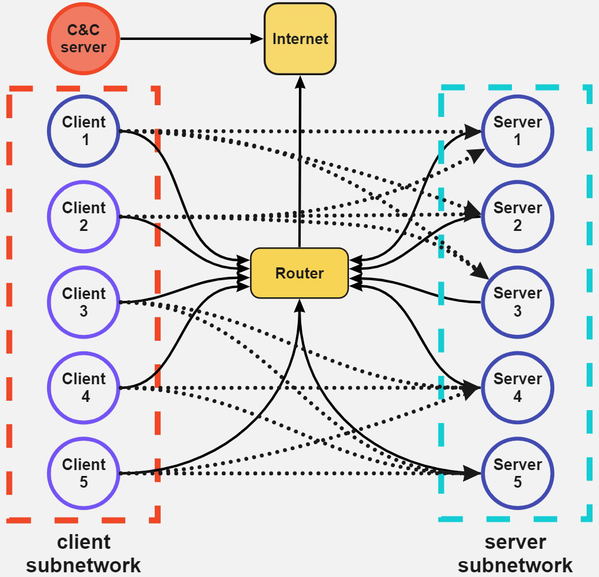
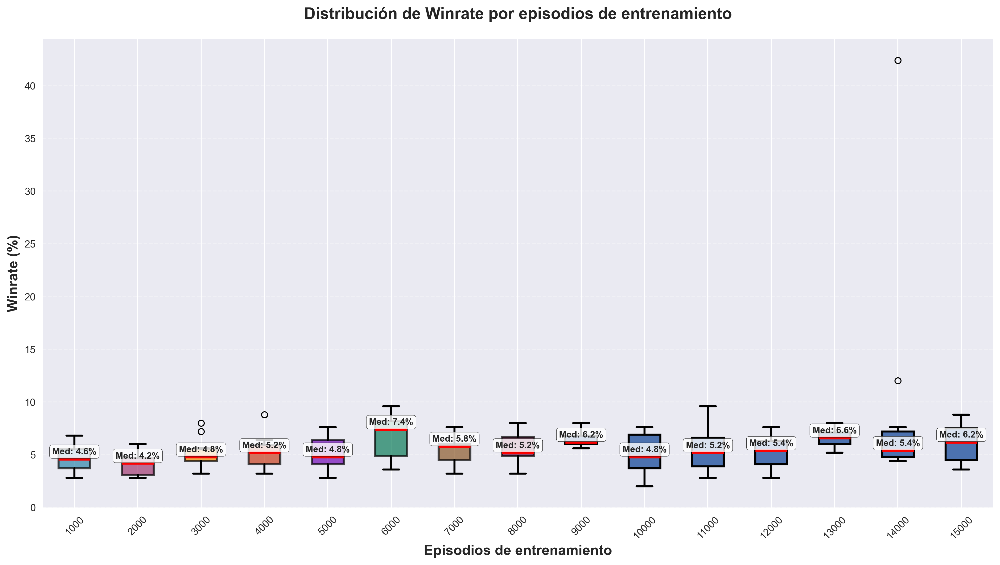
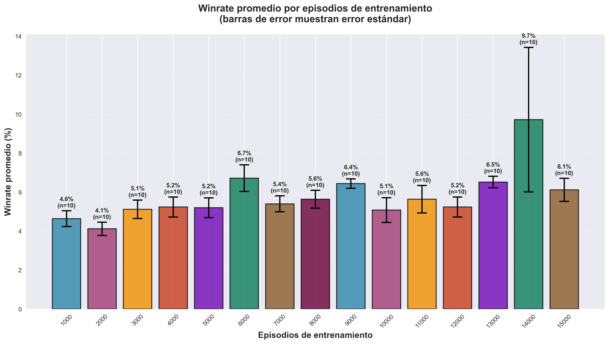
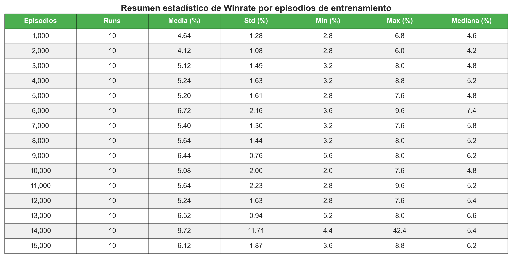

# NetSecGame: Caracterización del entorno y fundamentos de su selección para esta tesis

## Tabla de contenidos

1. [¿Qué es NetSecGame?](#qué-es-netsecgame)
2. [¿Cómo funciona?](#cómo-funciona)
   - [Arquitectura general](#arquitectura-general)
   - [Modo de uso](#modo-de-uso)
   - [Docker Container](#docker-container)
3. [¿Por qué fue creado?](#por-qué-fue-creado)
   - [Contexto académico](#contexto-académico)
   - [Problemas que busca resolver](#problemas-que-busca-resolver)
   - [Ventajas distintivas de NetSecGame](#ventajas-distintivas-de-netsecgame)
   - [Referencias relevantes](#referencias-relevantes)
   - [Usos principales](#usos-principales)
4. [Justificación de su elección para esta tesis](#justificación-de-su-elección-para-esta-tesis)
   - [Relevancia temática](#relevancia-temática)
   - [Adecuación técnica para Q-learning y ciberseguridad multiagente](#adecuación-técnica-para-q-learning-y-ciberseguridad-multiagente)
   - [Espacio controlado y reproducible](#espacio-controlado-y-reproducible)
   - [Soporte y extensibilidad](#soporte-y-extensibilidad)
   - [Limitaciones conocidas](#limitaciones-conocidas)
5. [Arquitectura](#arquitectura)
   - [Componentes del juego](#componentes-del-juego)
   - [GameState](#gamestate)
   - [Actions](#actions)
   - [Observations](#observations)
6. [Sistema de recompensas](#sistema-de-recompensas)
   - [Recompensas internas del agente Q-learning](#recompensas-internas-del-agente-q-learning)
   - [Análisis del diseño](#análisis-del-diseño)
7. [Selección y especificación de scenario1-full](#selección-y-especificación-de-scenario1-full)
   - [Arquitectura de red](#arquitectura-de-red)
   - [Descripción de nodos](#descripción-de-nodos)
   - [Dinámicas del entorno](#dinámicas-del-entorno)
   - [Complejidad computacional y escalabilidad](#complejidad-computacional-y-escalabilidad)
   - [Relevancia para la investigación](#relevancia-para-la-investigación)
8. [Análisis de resultados experimentales del algoritmo Q-learning en Scenario1](#análisis-de-resultados-experimentales-del-algoritmo-q-learning-en-scenario1-de-netsecgame)
   - [Análisis del rendimiento general](#análisis-del-rendimiento-general-1)
   - [Interpretación del análisis distribucional](#interpretación-del-análisis-distribucional)
   - [Factores contribuyentes a la variabilidad](#factores-contribuyentes-a-la-variabilidad)
9. [Conclusiones](#conclusiones)
---

## ¿Qué es NetSecGame?

[NetSecGame](https://github.com/stratosphereips/NetSecGame) (Network Security Game) es un framework para el entrenamiento y la evaluación de agentes de IA en tareas de seguridad de red (tanto ofensivas como defensivas). Desarrollado sobre el simulador de red [CYST](https://pypi.org/project/cyst/), permite la creación y prueba eficiente de agentes en escenarios altamente configurables. Ejemplos de agentes implementados pueden encontrarse en el submódulo [NetSecGameAgents](https://github.com/stratosphereips/NetSecGameAgents/tree/main). Este entorno fue desarrollado por el [Stratosphere Research Laboratory](https://www.stratosphereips.org/), grupo de investigación en ciberseguridad perteneciente al Centro de Inteligencia Artificial de la Facultad de Ingeniería Eléctrica de la Universidad Técnica Checa en Praga. Dicho grupo se especializa en la intersección entre ciberseguridad, aprendizaje automático y asistencia técnica.

NetSecGame modela escenarios realistas de redes computacionales, en los cuales los agentes pueden ejecutar acciones típicas de un atacante, tales como reconocimiento, explotación de vulnerabilidades, movimiento lateral y exfiltración de datos.

### Objetivo del simulador

El objetivo principal de NetSecGame es proporcionar un entorno controlado y reproducible que permita:
- Entrenar y evaluar agentes de aprendizaje por refuerzo en tareas de ciberseguridad.
- Simular ataques en redes computacionales.
- Facilitar la investigación en inteligencia artificial aplicada a la seguridad informática.

### Características principales

**Agente atacante**: El entorno se centra en agentes atacantes que deben explorar redes, descubrir vulnerabilidades y comprometer sistemas para alcanzar objetivos específicos.

**Entorno de red realista**: Simula topologías de red complejas con hosts, servicios, datos y reglas de conectividad que reflejan entornos empresariales reales.

**Simulación de ataques**: Reproduce el ciclo completo de un ataque cibernético: reconocimiento, acceso inicial, escalada de privilegios, movimiento lateral y exfiltración.

**Estados parcialmente observables**: Los agentes tienen conocimiento limitado del entorno y deben descubrir progresivamente la topología y recursos disponibles.

**Sistema de recompensas**: Implementa un sistema de recompensas que incentiva el logro de objetivos específicos.

---

## ¿Cómo funciona?

### Arquitectura general

NetSecGame adopta el paradigma clásico de interacción agente-entorno propio del aprendizaje por refuerzo. El ciclo de funcionamiento se compone de las siguientes etapas:

1. **Inicialización**: El entorno se configura con una topología de red específica, incluyendo hosts, servicios, datos y reglas de conectividad.

2. **Observación**: El agente recibe una observación del estado actual, que incluye su conocimiento parcial de la red (hosts conocidos, servicios descubiertos, hosts controlados, etc.).

3. **Acción**: El agente selecciona una acción conforme a su política actual (por ejemplo, escaneo de red, búsqueda de servicios, explotación de vulnerabilidades).

4. **Transición**: El entorno procesa la acción, actualiza su estado interno y determina si la acción fue exitosa según probabilidades predefinidas.

5. **Recompensa**: Se calcula una recompensa basada en el progreso del agente hacia sus objetivos y el costo de la acción ejecutada.

6. **Iteración**: El proceso se repite hasta que se alcanza una condición de terminación (éxito, límite de acciones, detección por el defensor).

### Modo de uso

Para iniciar NetSecGame, es necesario definir una configuración de tarea `task configuration`. En las pruebas realizadas, se empleó una configuración similar a la siguiente:

```
# Configuration file for the NetSecGame environment

coordinator:
  # Define the conf for all the 'attacker' agents.
  agents:
    Attacker:
      max_steps: 100
      goal:
        description: "Exfiltrate data to '213.47.23.195'"
        is_any_part_of_goal_random: True
        known_networks: []
        #known_networks: [192.168.1.0/24, 192.168.3.0/24]
        known_hosts: []
        #known_hosts: [192.168.1.1, 192.168.1.2]
        controlled_hosts: []
        #controlled_hosts: [213.47.23.195, 192.168.1.3]
        # Services are defined as a target host where the service must be, and then a description in the form 'name,type,version,is_local'
        known_services: {}
        #known_services: {192.168.1.3: [Local system, lanman server, 10.0.19041, False], 192.168.1.4: [Other system, SMB server, 21.2.39421, False]}
        # In data, put the target host that must have the data and which data in format user,data
        # Example to fix the data in one host
        known_data: {213.47.23.195: [[User1,DataFromServer1]]}
        # Example to fix two data in one host
        #known_data: {213.47.23.195: [[User1,DataFromServer1], [User5,DataFromServer5]]}
        # Example to fix the data in two host
        #known_data: {213.47.23.195: [User1,DataFromServer1], 192.168.3.1: [User3,Data3FromServer3]}
        # Example to ask a random data in a specific server. Putting 'random' in the data, forces the env to randomly choose where the goal data is
        # known_data: {213.47.23.195: [random]}
        known_blocks: {}
        # Example of known blocks. In the host 192.168.2.2, block all connections coming or going to 192.168.1.3
        # known_blocks: {192.168.2.2: {192.168.1.3}}
      start_position:
        known_networks: []
        known_hosts: []
        # The attacker must always at least control the CC if the goal is to exfiltrate there
        # Example of fixing the starting point of the agent in a local host
        controlled_hosts: [213.47.23.195, random]
        # Example of asking a random position to start the agent
        # controlled_hosts: [213.47.23.195, random]
        # Services are defined as a target host where the service must be, and then a description in the form 'name,type,version,is_local'
        known_services: {}
        # known_services: {192.168.1.3: [Local system, lanman server, 10.0.19041, False], 192.168.1.4: [Other system, SMB server, 21.2.39421, False]}
        # Same format as before
        known_data: {}
        known_blocks: {}
        # Example of known blocks to start with. In the host 192.168.2.2, block all connections coming or going to 192.168.1.3
        # known_blocks: {192.168.2.2: {192.168.1.3}}

    Defender:
      goal:
        description: "Block all attackers"
        is_any_part_of_goal_random: False
        known_networks: []
        # Example
        #known_networks: [192.168.1.0/24, 192.168.3.0/24]
        known_hosts: []
        # Example
        #known_hosts: [192.168.1.1, 192.168.1.2]
        controlled_hosts: []
        # Example
        #controlled_hosts: [213.47.23.195, 192.168.1.3]
        # Services are defined as a target host where the service must be, and then a description in the form 'name,type,version,is_local'
        known_services: {}
        # Example
        #known_services: {192.168.1.3: [Local system, lanman server, 10.0.19041, False], 192.168.1.4: [Other system, SMB server, 21.2.39421, False]}
        # In data, put the target host that must have the data and which data in format user,data
        # Example to fix the data in one host
        known_data: {}
        # Example to fix two data in one host
        #known_data: {213.47.23.195: [[User1,DataFromServer1], [User5,DataFromServer5]]}
        # Example to fix the data in two host
        #known_data: {213.47.23.195: [User1,DataFromServer1], 192.168.3.1: [User3,Data3FromServer3]}
        # Example to ask a random data in a specific server. Putting 'random' in the data, forces the env to randomly choose where the goal data is
        # known_data: {213.47.23.195: [random]}
        known_blocks: {213.47.23.195: 'all_attackers'}
        # Example of known blocks. In the host 192.168.2.2, block all connections coming or going to 192.168.1.3
        # known_blocks: {192.168.2.2: {192.168.1.3}}
        # You can also use the wildcard string 'all_routers', and 'all_attackers', to mean that all the controlled hosts of all the attackers should be in this list in order to win

      start_position:
        # should be empty for defender - will be extracted from controlled hosts
        known_networks: []
        # should be empty for defender - will be extracted from controlled hosts
        known_hosts: []
        # list of controlled hosts, wildard "all_local" can be used to include all local IPs
        controlled_hosts: [all_local]
        known_services: {}
        known_data: {}
        # Blocked IPs
        blocked_ips: {}
        known_blocks: {}
        # Example of known blocks to start with. In the host 192.168.2.2, block all connections coming or going to 192.168.1.3
        # known_blocks: {192.168.2.2: {192.168.1.3}}

env:
  # random means to choose the seed in a random way, so it is not fixed
  random_seed: 'random'
  # Or you can fix the seed
  # random_seed: 42
  scenario: 'scenario1'
  use_global_defender: False
  use_dynamic_addresses: False
  use_firewall: True
  save_trajectories: False
  rewards:
    success: 100
    step: -1
    fail: -10
  actions:
    scan_network:
      prob_success: 1.0
    find_services:
      prob_success: 1.0
    exploit_service:
      prob_success: 1.0
    find_data:
      prob_success: 1.0
    exfiltrate_data:
      prob_success: 1.0
    block_ip:

```

El entorno se inicia mediante el siguiente comando:

```
python3 -m AIDojoCoordinator.worlds.NSEGameCoordinator \
  --task_config=./examples/example_config.yaml \
  --game_port=9000
```

Una vez ejecutado, se crea un servidor de juego en localhost:9000, al cual los agentes pueden conectarse para interactuar con el entorno de NetSecGame.

#### Docker Container

NetSecGame puede inicializarse mediante un contenedor de Docker. Cuando se ejecuta dentro del entorno Docker, la aplicación puede iniciarse con el siguiente comando:

```
docker run -it --rm \
  -v $(pwd)/examples/example_config.yaml:/aidojo/netsecenv_conf.yaml \
  -v $(pwd)/logs:/aidojo/logs \
  -p 9000:9000 lukasond/aidojo-coordinator:1.0.2
```

--
## ¿Por qué fue creado?

### Contexto académico

NetSecGame surge en el marco de la investigación académica en ciberseguridad e inteligencia artificial, con el objetivo de suplir la carencia de entornos de simulación realistas y controlados para el entrenamiento de agentes autónomos en tareas de seguridad informática. En este contexto, existen otras iniciativas con propósitos similares, tales como [CybORG++](https://github.com/alan-turing-institute/CybORG_plus_plus), [CybORG](https://github.com/cage-challenge/CybORG,) [CyGil](https://arxiv.org/abs/2109.03331), [CyberBattleSim](https://github.com/microsoft/CyberBattleSim), [NASimEmu](https://github.com/jaromiru/NASimEmu), [PenGym](https://github.com/cyb3rlab/PenGym) y [CyberGym](https://github.com/sunblaze-ucb/cybergym), cada una con enfoques y niveles de complejidad distintos.

### Problemas que busca resolver

NetSecGame aborda diversas limitaciones presentes en los simuladores existentes:

**Escasez de entornos de entrenamiento**: La mayoría de los simuladores no reproducen adecuadamente las condiciones de redes empresariales reales.

**Evaluación reproducible**: Proporciona un entorno controlado que permite repetir experimentos bajo condiciones idénticas, facilitando la comparación de resultados.

**Escalabilidad**: Permite evaluar agentes en escenarios que varían desde redes simples hasta topologías complejas.

**Seguridad**: Ofrece un entorno seguro para experimentar con técnicas de ataque sin riesgo de dañar sistemas reales.

### Ventajas distintivas de NetSecGame

NetSecGame presenta varias ventajas significativas frente a otros entornos de simulación similares:

**Modularidad y extensibilidad**: Es muy modular y fácil de extender a nuevas topologías, lo que permite adaptar el entorno a diferentes necesidades de investigación.

**Realismo de la información**: El agente no recibe información artificial; todo dato disponible corresponde a lo que un atacante real podría obtener.

**Objetivo realista**: La meta principal —exfiltrar datos hacia Internet— refleja motivaciones reales en escenarios de ciberataques.

**Presencia de defensor**: La inclusión de un agente defensor añade complejidad y realismo a la simulación.

**Recompensas genéricas**: Las recompensas no están diseñadas específicamente para el problema particular, sino que son genéricas, lo que mejora la generalización de los enfoques desarrollados.

### Referencias relevantes

Si bien NetSecGame cuenta actualmente con un número limitado de citas en publicaciones académicas, se trata de un entorno de alta calidad, desarrollado por expertos en ciberseguridad del Cybersecurity Group del Artificial Intelligence Centre, perteneciente a la Faculty of Electrical Engineering de la Czech Technical University in Prague. Su diseño modular, capacidad para simular escenarios ofensivos y defensivos, y su orientación a la investigación en aprendizaje por refuerzo lo convierten en una plataforma valiosa y técnicamente robusta para la experimentación en tareas de seguridad de redes.

---

### Usos principales

NetSecGame ha sido utilizado en diversos contextos:

**Investigación**: Desarrollo y evaluación de algoritmos de aprendizaje automático para ciberseguridad.

**Docencia**: Enseñanza de conceptos de seguridad informática y técnicas de ataque en un entorno controlado.

**Validación de algoritmos**: Comparación objetiva de diferentes enfoques de agentes autónomos.

---

## Justificación de su elección para esta tesis

La selección de NetSecGame como entorno de simulación se fundamenta en su alineación directa con los objetivos de esta investigación, orientada a mejorar la inicialización de políticas en algoritmos de Q-learning aplicados a ciberseguridad multiagente.

### Relevancia temática

NetSecGame se alinea perfectamente con los objetivos de esta investigación al proporcionar:

- **Modelado realista**: Simula escenarios de ciberseguridad que reflejan desafíos del mundo real.
- **Complejidad controlada**: Permite evaluar agentes en entornos de complejidad variable.
- **Observabilidad parcial**: Modela la incertidumbre inherente en escenarios de ciberseguridad reales.

### Adecuación técnica para Q-learning y ciberseguridad multiagente

El entorno presenta características técnicas que lo hacen especialmente adecuado para esta investigación:

- **Representación explícita de estados, acciones y recompensas**: Proporciona estructuras de datos claras y extensibles (GameState, Action, Observation) que facilitan la implementación de Q-learning y la experimentación con diferentes estrategias de inicialización de políticas. 

- **Complejidad escalable**: Permite evaluar métodos de inicialización desde escenarios simples (pocas redes y hosts) hasta complejos (múltiples subredes interconectadas), facilitando el análisis del impacto de diferentes estrategias de inicialización según la complejidad del problema.

- **Observabilidad parcial realista**: El descubrimiento progresivo del entorno simula condiciones reales donde el agente debe aprender con información limitada, siendo crucial para evaluar cómo diferentes inicializaciones de política afectan la exploración y el aprendizaje.

- **Arquitectura multiagente extensible**: Aunque actualmente enfocado en agentes atacantes, su diseño modular permite la extensión a escenarios multiagente donde múltiples atacantes o atacantes-defensores interactúan.

### Espacio controlado y reproducible

**Determinismo configurable**: Posibilita la repetición exacta de experimentos para análisis comparativos.

**Escalabilidad**: Facilita la evaluación desde escenarios simples hasta complejos, permitiendo análisis comparativos sistemáticos.

**Métricas integradas**: Incluye sistemas de logging y métricas que facilitan el análisis de rendimiento.

### Soporte y extensibilidad

**Código abierto**: Base de código disponible y documentada que permite modificaciones y extensiones.

**Configurabilidad**: Arquitectura modular que permite adaptar escenarios según necesidades específicas.

**Comunidad activa**: Soporte continuo y desarrollo activo por parte de la comunidad académica.

### Limitaciones conocidas

**Complejidad exponencial**: El espacio de estados crece exponencialmente con el tamaño del entorno, lo que puede limitar la escalabilidad.

**Simplicidad del defensor**: El defensor no es un agente autónomo, sino un sistema estocástico simple.

**Limitaciones de realismo**: Aunque realista, sigue siendo una abstracción de redes reales.

**Dependencias técnicas**: Requiere configuración específica y conocimiento técnico para su uso efectivo.

NetSecGame constituye la plataforma más adecuada para abordar la problemática de inicialización de políticas en Q-learning aplicado a ciberseguridad multiagente. Su diseño técnico, capacidad de simulación realista, y flexibilidad experimental permiten enfocar los esfuerzos de investigación en el análisis profundo del comportamiento de los agentes, garantizando resultados reproducibles y relevantes para aplicaciones reales.

La adopción de NetSecGame permite enfocar completamente los esfuerzos de investigación en el problema específico de inicialización de políticas, aprovechando un entorno maduro, bien documentado y técnicamente robusto que facilitará la obtención de resultados significativos y reproducibles en el área de investigación propuesta.


--- 

## Arquitectura 

NetSecGame opera como un servidor de simulación que implementa el paradigma clásico de interacción agente-entorno propio del aprendizaje por refuerzo. Los agentes se conectan al servidor mediante sockets TCP y participan en simulaciones en tiempo real, enviando acciones y recibiendo observaciones del entorno en cada iteración del ciclo de entrenamiento.

Este diseño permite ejecutar simulaciones multiagente altamente configurables, en las que cada agente puede actuar de forma autónoma y recibir retroalimentación específica según su desempeño.

### Componentes del juego

El entorno está estructurado en torno a una serie de clases que representan los elementos clave del estado del juego. Estas clases se utilizan tanto en la definición de acciones `Actions` omo en la representación del estado `GameState`.

#### IP

IP es un objeto inmutable que representa un objeto IPv4 en NetSecGame. Tiene un único parámetro: la dirección en notación decimal con punto (4 octetos representados como un valor decimal separado por puntos).

Ejemplo:

```
ip = IP("192.168.1.1")
```

#### Network

Network es un objeto inmutable que representa un objeto de red IPv4 en NetSecGame. Tiene dos parámetros: 
- network_ip: str, que representa la dirección IPv4 de la red. 
- mask: int, que representa la máscara en notación CIDR.

Ejemplo: 
```
net = Network("192.168.1.0", 24)
```

#### Service

Service contiene información sobre los servicios que se ejecutan en los hosts. Cada servicio tiene cuatro parámetros: 
- name: str, nombre del servicio (p. ej., "SSH").
- type: str, pasivo o activo. Actualmente no se utiliza. 
- version: str, versión del servicio. 
- is_local: bool, indicador que especifica si el servicio es solo local. (Si es True, el servicio NO es visible sin controlar el host).

Ejemplo: 

```
s = Service('postgresql', 'passive', '14.3.0', False)
```

#### Data

Data contiene información sobre los puntos de datos (archivos) presentes en NetSecGame. Sus posibles parámetros son: 
- owner: str - especifica el usuario propietario de este punto de datos 
- id: str - identificador único del punto de datos en un host 
- size: int - tamaño del punto de datos (opcional, valor predeterminado = 0) 
- type: str - identificación del tipo de archivo (opcional, valor predeterminado = "") 
- content: str - contenido de los datos (opcional, valor predeterminado = "")

Ejemplos: 

```
d1 = Data("User1", "DatabaseData")
d2 = Data("User1", "DatabaseData", size=42, type="txt", "SecretUserDatabase")
```

### GameState


GameState es un objeto que representa una vista del entorno NetSecGame en un estado dado. Se construye como una colección de 'assets' disponibles para el agente. GameState tiene las siguientes partes:

| Variable             | Tipo de dato                        | Descripción                                                                 |
|----------------------|-------------------------------------|-----------------------------------------------------------------------------|
| `known_networks`     | `set[str]`                          | Subredes conocidas por el agente (ej. '192.168.1.0/24').                    |
| `known_hosts`        | `set[str]`                          | IPs de hosts descubiertos mediante escaneo.                                 |
| `controlled_hosts`   | `set[str]`                          | IPs de hosts comprometidos exitosamente.                                    |
| `known_services`     | `dict[str, set[Service]]`           | Mapeo IP → conjunto de servicios descubiertos (nombre, tipo, versión).      |
| `known_data`         | `dict[str, set[Data]]`              | Mapeo IP → conjunto de datos descubiertos (propietario, identificador).     |

> Nota: Los tipos `Service` y `Data` corresponden a estructuras o clases que encapsulan la información relevante de cada servicio (nombre, tipo, versión) y de cada dato (propietario, identificador), respectivamente.

A continuación se presenta una explicación detallada de cada variable:

- **`known_networks` (`set[str]`)**: Representa el conjunto de subredes que el agente atacante ha identificado en el entorno. Cada elemento es una cadena en notación CIDR (por ejemplo, '10.0.0.0/24'). Esta variable delimita el alcance de exploración posible y condiciona las acciones de escaneo de hosts.

- **`known_hosts` (`set[str]`)**: Contiene las direcciones IP de los hosts que el agente ha descubierto mediante acciones de escaneo. Cada IP es una cadena. El crecimiento de este conjunto refleja el avance del agente en el reconocimiento de la topología de la red.

- **`controlled_hosts` (`set[str]`)**: Incluye las IPs de los hosts sobre los cuales el agente ha obtenido control, generalmente tras explotar vulnerabilidades. Desde estos hosts es posible ejecutar acciones avanzadas, como la búsqueda y exfiltración de datos. El tamaño de este conjunto es un indicador directo del progreso ofensivo del agente.

- **`known_services` (`dict[str, set[Service]]`)**: Es un diccionario donde la clave es la IP de un host conocido y el valor es un conjunto de objetos `Service`. Cada objeto `Service` describe un servicio identificado en ese host, incluyendo atributos como nombre, tipo y versión. Esta variable es fundamental para la identificación de posibles vectores de ataque y para la planificación de acciones de explotación. El formato del diccionario: {IP: {Service}} donde el objeto IP es una clave y el valor es un conjunto de objetos de servicio ubicados en la IP.

- **`known_data` (`dict[str, set[Data]]`)**: Es un diccionario donde la clave es la IP de un host controlado y el valor es un conjunto de objetos `Data`. Cada objeto `Data` representa un dato descubierto, con información sobre el propietario y un identificador único. El descubrimiento de datos es el objetivo final en muchos escenarios, por lo que esta variable es crítica para la evaluación del desempeño del agente. El formato del diccionario: {IP: {Data}} donde el objeto IP es una clave y el valor es un conjunto de objetos de datos ubicados en la IP.

> Nota: El entorno no permite la eliminación de elementos del estado, lo que implica un crecimiento monótono del espacio de estados.

#### Complejidad del espacio de estados

El espacio de estados presenta un crecimiento exponencial respecto al número de elementos presentes en el entorno. Esta característica impone desafíos significativos para algoritmos de aprendizaje por refuerzo, especialmente aquellos basados en tablas como Q-learning. La cota superior puede estimarse como:

$$
\mathcal{O}\left(2^{(n-1)} \cdot 3^{(h-2)} \cdot 2^{(s-1)} \cdot 2^{(d \cdot h)}\right)
$$

Donde:
- \( n \): número de redes
- \( h \): número de hosts
- \( s \): número de servicios
- \( d \): número de datos por host


La expresión de la cota superior del espacio de estados puede desglosarse de la siguiente manera:

- $2^{(n-1)}$: Representa la posibilidad de conocer o no cada una de las $n$ redes del entorno, considerando que el agente inicia con al menos una red conocida.
- $3^{(h-2)}$: Cada uno de los $h$ hosts puede estar en uno de tres estados: desconocido, conocido o controlado. Se asume que el agente comienza con al menos dos hosts controlados.
- $2^s$: Cada uno de los $s$ servicios presentes en el entorno puede ser conocido o desconocido para el agente.
- $2^{(d \cdot h)}$: Cada uno de los $d$ datos posibles puede estar presente o no en cada uno de los $h$ hosts del entorno.

Este crecimiento exponencial implica que:

- El espacio de búsqueda es enorme, incluso para configuraciones moderadas.
- La exploración eficiente se vuelve crítica para evitar trayectorias subóptimas.
- La inicialización de políticas (como las Q-tables) debe considerar estrategias que guíen la exploración hacia regiones prometedoras del espacio.
- La escalabilidad del algoritmo depende de la capacidad para generalizar y abstraer estados relevantes.

### Actions

En NetSecGame, los agentes interactúan con el entorno mediante el envío de acciones estructuradas, que son evaluadas y ejecutadas por el simulador si cumplen con las condiciones de validez y contexto. Actualmente, el entorno está diseñado para agentes atacantes, mientras que el defensor opera como un sistema estocástico no autónomo.

Cada acción consta de dos componentes:
1. Tipo de acción: Define la clase de operación a realizar (por ejemplo, escaneo, explotación, exfiltración). 
2. Parámetros: Diccionario con los valores específicos requeridos para ejecutar la acción (por ejemplo, IP de origen, red objetivo, servicio a explotar).

#### Lista de tipos de acción

- **JoinGame**, params={agent_info:AgentInfo(<name>, <role>)}: Registra al agente en el entorno con un rol específico.
- **QuitGame**, params={}: Finaliza la participación del agente en el entorno.
- **ResetGame**, params={request_trajectory:bool}: Reinicia el entorno. Si request_trajectory = True, el coordinador enviará la trayectoria completa de la ejecución anterior en el siguiente mensaje.
- **ScanNetwork**, params{source_host:<IP>, target_network:<Network>}: Escanea la <Network> dada desde un host de origen especificado. Detecta TODOS los hosts de una red accesibles desde <IP>. Si la operación es correcta, devuelve el conjunto de objetos <IP> detectados.
- **FindServices**, params={source_host:<IP>, target_host:<IP>}: Detecta todos los servicios que se ejecutan en el target_host si este es accesible desde source_host. Si la operación es correcta, devuelve un conjunto de todos los objetos <Service> detectados.
- **FindData**, params={source_host:<IP>, target_host:<IP>}: Busca datos en el target_host. Si source_host difiere de target_host, la operación depende de la accesibilidad desde source_host. Si la operación es correcta, devuelve un conjunto de todos los objetos <Data> detectados.
- **ExploitService**, params={source_host:<IP>, target_host:<IP>, taget_service:<Service>}: Explota el target_service en un target_host especificado. Si tiene éxito, el atacante obtiene el control del target_host.
- **ExfiltrateData**, params{source_host:<IP>, target_host:<IP>, data:<IP>}: Copia datos del source_host al target_host si ambos están controlados y el target_host es accesible desde el source_host.

#### Impacto de las acciones en el entorno

Cada acción modifica el estado del entorno de forma específica. A continuación se resumen sus efectos y precondiciones:

| Acción          | Parámetros                                           | Precondiciones                                                                 | Efectos                                                       |
|-----------------|-------------------------------------------------|-------------------------------------------------------------------------------|---------------------------------------------------------------|
| ScanNetwork     | `source_host`, `target_network`                  | `source_host ∈ controlled_hosts`                                              | expande `known_networks`                                      |
| FindServices    | `source_host`, `target_host`                     | `source_host ∈ controlled_hosts`                                              | expande `known_services` AND `known_hosts`                    |
| FindData        | `source_host`, `target_host`                     | `source_host, target_host ∈ controlled_hosts`                                | expande `known_data`                                          |
| ExploitService  | `source_host`, `target_host`, `target_service`   | `source_host ∈ controlled_hosts`                                              | expande `controlled_hosts` with `target_host`                 |
| ExfiltrateData  | `source_host`, `target_host`, `data`             | `source_host, target_host ∈ controlled_hosts` AND `data ∈ known_data`        | expande `known_data[target_host]` with `data`                 |


#### Supuestos y condiciones para las acciones

1. Al ejecutar la acción `ExploitService`, se espera que el agente haya detectado este servicio previamente (al ejecutar `FindServices` en el host_objetivo antes de esta acción).  
2. La acción `Find Data` encuentra todos los datos disponibles en el host si se ejecuta correctamente.  
3. La acción `Find Data` requiere la propiedad del host objetivo.  
4. Ejecutar `ExfiltrateData` requiere controlar tanto el host de origen como el de destino.  
5. La ejecución de `Find Services` permite detectar hosts (si estos tienen servicios activos).  
6. Los parámetros de `ScanNetwork` y `FindServices` se pueden elegir arbitrariamente (no es necesario que estén listados en `known_newtworks` o `known_hosts`).  


### Observations

Tras enviar la Acción `a` al entorno, los agentes reciben una `Observation`. Cada observación consta de 4 partes: 
- state: `Gamestate`, con la vista actual del estado del entorno; 
- reward: `int`, con la recompensa inmediata que el agente recibe por ejecutar la Acción `a`; 
- end: `bool`, indica si la interacción puede continuar después de ejecutar la Acción `a`; 
- info: `dict`, marcador de posición para cualquier información proporcionada al agente (p. ej., la razón por la que `end is True`).

Este diseño permite que el agente procese la retroalimentación de forma estructurada, facilitando la actualización de su política de acción y la evaluación de su desempeño en función de los objetivos definidos.

## Sistema de recompensas

El sistema de recompensas en NetSecGame está diseñado para proporcionar retroalimentación escasa pero significativa, enfocada en eventos críticos que reflejan el progreso del agente hacia sus objetivos. Esta estructura favorece la evaluación de estrategias de planificación secuencial en entornos de ciberseguridad realistas.

Las recompensas de cada acción son escasas. 
| Evento                         | Condición                                      | Recompensa del entorno |
|-------------------------------|------------------------------------------------|------------------------|
| Paso normal                | No conduce al objetivo ni a detección          | -1                     |
| Éxito (exfiltración exitosa) | El agente alcanza el estado objetivo           | +100                   |
| Detección                    | El agente es detectado por el defensor         | -50                    |

Este esquema penaliza el comportamiento ineficiente y recompensa únicamente el logro del objetivo principal, lo que obliga al agente a desarrollar estrategias efectivas y discretas.

### Recompensas internas del agente Q-learning

Para mejorar la eficiencia del aprendizaje, el agente de Q-learning redefine la función de recompensa mediante el método `recompute_reward`, con el objetivo de:

- Aumentar el contraste entre éxito y fracaso.
- Penalizar más severamente los errores.
- Acelerar la convergencia del valor Q.
 
#### Eventos que disparan Recompensas

| Evento | Condición de activación |Recompensa Q-Agent |
|--------|------------------------|-------------------|
| **Paso normal** | Acción que no termina episodio | -1 |
| **Éxito (exfiltración exitosa)** | `AgentStatus.Success` | +1000 |
| **Detección** | `AgentStatus.Fail` | -1000 | 
| **Timeout (límite de pasos)** | `AgentStatus.TimeoutReached` |-100 | 

Esta redefinición refuerza el comportamiento deseado (exfiltración sin ser detectado) y proporciona señales más claras para guiar la exploración del agente.

### Análisis del diseño

#### Fortalezas principales:
- **Alineación con los objetivos del entorno**: La recompensa está directamente vinculada al éxito operativo del agente.
- **Simplicidad y claridad**: La función es fácil de interpretar y mantener.


#### Limitaciones críticas:

- **Ausencia de recompensas intermedias**: La función de recompensa no proporciona retroalimentación parcial ante logros intermedios (ej.: controlar un host o descubrir un dato). 

- **Exploración poco guiada**: En etapas tempranas, el agente puede carecer de señales útiles para aprender rutas efectivas hacia el objetivo.


## Selección y especificación de scenario1-full

La elección del escenario Scenario1-Full dentro del entorno NetSecGame se fundamenta en su capacidad para representar de manera realista y controlada los desafíos que enfrentan los sistemas de ciberseguridad en entornos corporativos. Este escenario proporciona una base sólida para evaluar el desempeño de agentes de aprendizaje por refuerzo en tareas ofensivas como la exfiltración de datos, el movimiento lateral y la explotación de vulnerabilidades. Este escenario fue elegido por su capacidad de reproducir de manera controlada los desafíos que enfrentan los sistemas de ciberseguridad en contextos corporativos reales, integrando tanto superficies de ataque como mecanismos de defensa que permiten probar el desempeño de los agentes bajo condiciones diversas y exigentes.

Scenario1-Full fue seleccionado por las siguientes razones:

- Complejidad estructural: Integra múltiples subredes, servicios, usuarios y políticas de acceso que simulan una red empresarial real.
- Presencia de mecanismos defensivos: Incluye firewalls y segmentación de red que obligan al agente a planificar rutas de ataque sofisticadas.
- Escalabilidad: Permite extender la arquitectura para evaluar el comportamiento del agente en escenarios más complejos.
- Relevancia práctica: Refleja situaciones comunes en entornos corporativos, lo que facilita la transferencia de resultados a aplicaciones reales.

### Arquitectura de red

#### Topología general

La arquitectura de red del Scenario1 Full presentada en la Figura N, se estructura mediante una topología segmentada que comprende dos subredes principales interconectadas a través de un router central con funcionalidades de firewall integradas. Esta configuración refleja las mejores prácticas de segmentación de red utilizadas en entornos empresariales para limitar el alcance de potenciales compromisos de seguridad.


*Figura X: Topología de red del escenario1 full de NetSecGame.*

Las subredes están organizadas de la siguiente manera:

- **Subred de servidores**: 192.168.1.0/24 - Aloja los recursos críticos de la organización.
- **Subred de clientes**: 192.168.2.0/24 - Representa las estaciones de trabajo de usuarios finales.
- **Conectividad externa**: 213.47.23.192/26 - Simula la conectividad a Internet.

### Router central

El router central, accesible mediante las direcciones 192.168.1.1 y 192.168.2.1, funciona como el punto de control y seguridad de la red. Este dispositivo implementa:

- Funcionalidades de firewall con políticas restrictivas configuradas por defecto (política DENY).
- Reglas de acceso específicas que regulan la comunicación entre las diferentes subredes.
- Gateway de conectividad externa para operaciones que requieren acceso a Internet.
- Filtrado de tráfico basado en políticas de seguridad predefinidas.


### Descripción de nodos

#### Nodos servidor

La subred de servidores contiene cinco sistemas que alojan diferentes servicios y tipos de datos, cada uno configurado con características específicas que representan diferentes roles dentro de una infraestructura corporativa.

##### Servidor SMB (192.168.1.2)

Este sistema ejecuta Windows Server y proporciona servicios de compartición de archivos mediante el protocolo SMB (Server Message Block). Los servicios configurados incluyen:

- **microsoft-ds**: Servicio SMB/CIFS para compartición de archivos, identificado como vulnerable a exploits remotos.
- **ms-wbt-server**: Servicio de Remote Desktop Protocol para acceso remoto.
- **windows login**: Sistema de autenticación local.

El servidor almacena múltiples conjuntos de datos sensibles: DataFromServer1 (propiedad de User1), Data2FromServer1 (propiedad de User2), y Data3FromServer1 (propiedad de User1). Los usuarios autorizados incluyen User1 a User5 y el usuario Administrator.

La vulnerabilidad del servicio SMB constituye un vector de ataque principal, permitiendo la explotación remota para acceder a los datos almacenados en el sistema.

##### Servidor de base de datos (192.168.1.3)

Sistema basado en Linux que aloja servicios de base de datos críticos:

- **ssh**: OpenSSH versión 8.1.0 para acceso remoto seguro.
- **postgresql**: Sistema de gestión de base de datos PostgreSQL versión 14.3.0.

El servidor contiene DatabaseData (propiedad de User1) y cuenta con usuarios User1 a User5 además del usuario root. El acceso requiere autenticación SSH válida, proporcionando una capa adicional de seguridad comparado con otros servicios.

##### Servidor web (192.168.1.4)

Sistema Linux configurado para servicios web con las siguientes características:

- **http**: Servidor web lighttpd versión 1.4.54.
- **ssh**: OpenSSH versión 8.1.0.

Almacena WebServerData (propiedad de User2). Los usuarios autorizados incluyen User1 a User5 y root.

##### Servidores adicionales (192.168.1.5 y 192.168.1.6)

Ambos sistemas ejecutan Linux y proporcionan servicios básicos:

- **ssh**: Acceso remoto únicamente.
- **Usuarios**: Solo el usuario root.
- **Función**: Servidores de propósito general con acceso altamente restringido.

Estos nodos sirven como objetivos secundarios y puntos potenciales para movimiento lateral dentro de la red.

#### Nodos cliente

La subred de clientes comprende cinco estaciones de trabajo que representan diferentes puntos de entrada potenciales para un atacante. Estos sistemas simulan las estaciones de trabajo típicas encontradas en entornos corporativos.

##### Cliente 1 (192.168.2.2)

Constituye el punto de ataque principal del escenario:

- **Sistema operativo**: Windows.
- **Servicios**: ms-wbt-server y can_attack_start_here (marcador de punto de inicio).
- **Servicio especial**: attacker - representa al agente atacante controlado por IA.
- **Usuarios**: User1 y Administrator.

Este nodo está preconfigurado como el punto de inicio predeterminado para el agente atacante, proporcionando la base para iniciar operaciones de reconocimiento y ataque.

##### Clientes 2-5 (192.168.2.3-192.168.2.6)

Los clientes restantes proporcionan diversidad en términos de sistemas operativos y configuraciones:

- **Cliente 2** (192.168.2.3): Sistema Windows  y marcador de inicio, usuarios User2 y Administrator.
- **Cliente 3** (192.168.2.4): Sistema Linux con SSH y marcador de inicio, usuarios User3 y root.
- **Cliente 4** (192.168.2.5): Sistema Linux con SSH y marcador de inicio, usuarios User4 y root.
- **Cliente 5** (192.168.2.6): Sistema Linux con acceso solo local, usuarios User5 y root.

Esta diversidad permite evaluar la capacidad del agente para adaptarse a diferentes plataformas y configuraciones de seguridad.

#### Nodo externo

##### Outside node C&C Server (213.47.23.195)

Representa un sistema externo en Internet configurado específicamente para operaciones de exfiltración:

- **Ubicación**: Internet simulado.
- **Servicios**: listener para recepción de datos exfiltrados.
- **Control**: Bajo control del atacante.
- **Función**: Destino final para la transferencia de datos comprometidos.

### Dinámicas del entorno

#### Objetivo y mecánicas de juego

El objetivo principal del agente atacante consiste en completar una secuencia de acciones que comprende: iniciación desde un nodo cliente, exploración de la red para identificar servicios y vulnerabilidades, explotación de sistemas vulnerables, localización de datos sensibles en los servidores, y exfiltración de información al nodo externo.

Esta secuencia requiere que el agente desarrolle estrategias de planificación secuencial, evaluación de riesgos, y optimización de recursos dentro de las limitaciones impuestas por los mecanismos de defensa del entorno.

#### Rutas de ataque

##### Ruta principal: explotación SMB

La estrategia de ataque más directa involucra:

1. **Iniciación**: Activación del agente en Cliente 1 con servicio atacante activo.
2. **Reconocimiento**: Escaneo sistemático de la subred de servidores para identificar servicios disponibles.
3. **Explotación**: Utilización del exploit SMB contra el servicio microsoft-ds en el servidor SMB.
4. **Acceso a datos**: Recuperación de archivos críticos almacenados en el sistema comprometido.
5. **Exfiltración**: Transferencia de datos al outside node através de la conectividad externa.

#### Configuración de acceso y autenticación

##### Sistemas de autenticación

Cada nodo mantiene su propio sistema de usuarios y credenciales:

- **Autenticación local**: Cada sistema gestiona independientemente sus usuarios autorizados
- **Niveles de privilegio**:
  - LIMITED: Acceso básico de usuario con permisos restringidos.
  - ELEVATED: Privilegios administrativos con acceso completo al sistema.

##### Políticas de firewall

El router central implementa políticas de acceso estrictas:

- **Cadena INPUT**: Permite únicamente acceso directo desde subredes específicamente autorizadas.
- **Cadena FORWARD**: Reglas granulares para comunicación entre subredes.
- **Política predeterminada**: DENY (denegación explícita de todo tráfico no autorizado).

Esta configuración refleja las mejores prácticas de seguridad de red, requiriendo que el agente desarrolle estrategias sofisticadas para navegar las restricciones de acceso.

### Complejidad computacional y escalabilidad

#### Dimensiones del espacio de estados

El Scenario1 Full presenta un espacio de estados multidimensional caracterizado por:

- **Diez nodos activos**: Cada uno con múltiples servicios y estados de configuración posibles.
- **Servicios heterogéneos**: Diferentes protocolos, versiones y configuraciones de seguridad.
- **Estados de compromiso**: Múltiples niveles de acceso y control por nodo.
- **Distribución de datos**: Información crítica dispersa en varios servidores con diferentes niveles de protección.

#### Variabilidad del entorno

El entorno presenta características dinámicas que aumentan su complejidad:

- **Múltiples rutas de solución**: Diversas estrategias válidas para alcanzar los objetivos del escenario.
- **Escalabilidad**: Arquitectura base que puede extenderse para crear escenarios de mayor complejidad.


### Relevancia para la investigación

El Scenario1 Full de NetSecGame proporciona un entorno de entrenamiento completo y metodológicamente riguroso para la investigación en ciberseguridad y aprendizaje automático. Su diseño incorpora elementos realistas de infraestructuras de red corporativas, manteniendo al mismo tiempo la controlabilidad necesaria para experimentos reproducibles.

La complejidad inherente del escenario, combinada con sus múltiples rutas de solución, lo convierte en una plataforma valiosa para evaluar y comparar diferentes aproximaciones algorítmicas en el dominio de la ciberseguridad ofensiva. Además, su arquitectura escalable proporciona una base sólida para el desarrollo de escenarios más complejos en investigaciones futuras.


## Análisis de resultados experimentales del algoritmo Q-learning en Scenario1 de NetSecGame

Se realizaron 10 ejecuciones independientes del algoritmo Q-learning en el escenario Scenario1-Full de NetSecGame, con el objetivo de evaluar el impacto de diferentes configuraciones de entrenamiento sobre el rendimiento del agente atacante. Las configuraciones variaron entre 1,000 y 15,000 episodios, permitiendo observar tendencias de aprendizaje, consistencia y sensibilidad a la aleatoriedad.


*Figura X+1: Distribución de winrate por episodios de entrenamiento. Los boxplots muestran la mediana (línea roja), cuartiles y valores atípicos para cada configuración.*


*Figura X+2: Winrate promedio por episodios de entrenamiento. Las barras de error representan el error estándar de la media (n=10 por configuración).*


*Tabla 1: Resumen estadístico obtenido tras 10 ejecuciones independientes.*

### Análisis del rendimiento general

#### Tendencias de los promedios

Los resultados observados en la Figura X+2 y en el resumen estadístico de la Tabla 1, muestran un rendimiento general modesto del algoritmo Q-learning, con winrates promedio que oscilan entre 4.12% y 9.72% a lo largo de las diferentes configuraciones de episodios de entrenamiento. El análisis de las medias revela un patrón no monótono en el rendimiento, donde el incremento en el número de episodios de entrenamiento no se traduce consistentemente en mejoras del winrate.

La configuración de 14,000 episodios presenta el mejor rendimiento promedio (9.72%), seguida por las configuraciones de 6,000 episodios (6.72%) y 13,000 episodios (6.52%). Este comportamiento sugiere que el algoritmo puede beneficiarse de un entrenamiento prolongado en ciertos rangos específicos, pero no muestra una curva de aprendizaje estrictamente creciente.

Las medianas, en general, mantienen valores cercanos a las medias (diferencias típicas menores al 1%), lo que indica distribuciones relativamente simétricas en la mayoría de las configuraciones. Esta característica sugiere ausencia de sesgos significativos hacia valores extremos en el rendimiento.

#### Análisis de consistencia y variabilidad

La desviación estándar de los resultados presentados en la Tabla 1, muestran variaciones considerables entre configuraciones, oscilando desde 0.76% (9,000 episodios) hasta 11.71% (14,000 episodios). Esta variabilidad heterogénea indica que la consistencia del algoritmo está fuertemente influenciada por el número de episodios de entrenamiento.

Las configuraciones con menor variabilidad (9,000, 13,000 y 7,000 episodios con desviaciones estándar de 0.76%, 0.94% y 1.30% respectivamente) demuestran mayor estabilidad en el rendimiento, mientras que la configuración de 14,000 episodios, a pesar de mostrar el mejor rendimiento promedio, exhibe la mayor variabilidad (11.71% de desviación estándar).


### Interpretación del análisis distribucional

#### Comparación entre gráfico de barras y boxplot

El boxplot correspondiente a 14,000 episodios presentado en la Figura X+1, muestra un valor atípico significativo (aproximadamente 42.4%), lo que explica la elevada desviación estándar observada en esta configuración (ver Tabla 1). Este outlier sugiere que, bajo ciertas condiciones específicas, el algoritmo puede alcanzar rendimientos sustancialmente superiores, pero esta mejora no es reproducible consistentemente.

La presencia de valores atípicos en varias configuraciones (particularmente visibles en 3,000, 4,000 y 14,000 episodios) indica que el algoritmo ocasionalmente encuentra estrategias exitosas, pero estas no se consolidan como comportamiento estándar.


### Factores contribuyentes a la variabilidad

La variabilidad observada puede atribuirse principalmente a tres factores fundamentales:

1. **Inicialización en cero de Q-tables**: Comenzar con todos los valores Q igual a cero establece un punto de partida uniforme para todos los estados y acciones. Si bien esto elimina la variabilidad inicial causada por valores aleatorios, también puede generar trayectorias de aprendizaje más lentas en las etapas tempranas del entrenamiento debido a la ausencia de sesgos exploratorios iniciales.

2. **Balance exploración-explotación**: La política ε-greedy utilizada introduce estocasticidad inherente que puede resultar en diferentes rutas de descubrimiento de estrategias exitosas entre ejecuciones.

3. **Complejidad del entorno**: El Scenario1 Full presenta múltiples rutas de ataque posibles y estados intermedios, creando un espacio de búsqueda complejo donde pequeñas diferencias en las decisiones tempranas pueden amplificarse significativamente.


## Conclusiones

En conclusión, los resultados presentados constituyen una línea base importante para futuras mejoras algorítmicas y proporcionan evidencia empírica de la complejidad inherente del dominio de ciberseguridad simulada en NetSecGame.

La investigación confirma la idoneidad de NetSecGame como plataforma de evaluación para algoritmos de aprendizaje por refuerzo en ciberseguridad. Su arquitectura modular, sistema de recompensas configurable y capacidad para modelar escenarios realistas de ataques cibernéticos lo posicionan como una herramienta valiosa para la comunidad de investigación. La reproducibilidad de experimentos, facilitada por el control determinístico de la aleatoriedad, permite comparaciones objetivas entre diferentes aproximaciones algorítmicas.

NetSecGame demuestra ser una plataforma competente y técnicamente adecuada para abordar preguntas de investigación sobre inicialización de políticas y comportamiento de agentes en dominios de ciberseguridad. Los resultados actuales sirven como **línea base**: muestran que, con la configuración y algoritmo tabular empleados, el dominio es desafiante y altamente sensible a la aleatoriedad y diseño de recompensas.

La implementación actual de Q-learning, con inicialización uniforme en cero, establece una línea base comparativa para evaluar mejoras algorítmicas. Si bien este enfoque garantiza imparcialidad inicial, puede inducir trayectorias de aprendizaje subóptimas debido a la falta de sesgos exploratorios.

Se propone investigar y evaluar técnicas avanzadas de inicialización de Q-tables y políticas que aceleren la convergencia y mejoren la exploración,tales como:

- Inicialización optimista: usar valores iniciales más altos para fomentar la exploración temprana.
- Preentrenamiento: entrenar una Q-table inicial mediante episodios de prueba.
- Técnicas evolutivas: optimizar la Q-table inicial mediante algoritmos genéticos o estrategias evolutivas, especialmente para entornos con alto espacio de estados.
