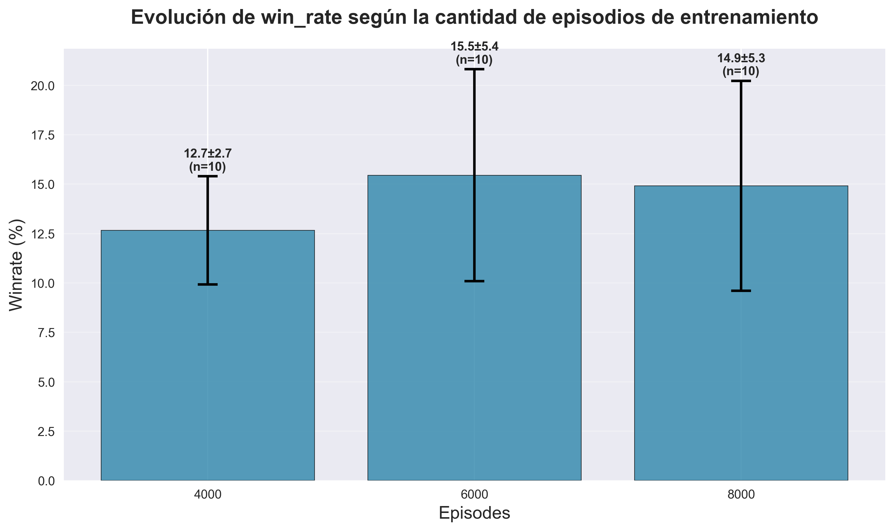
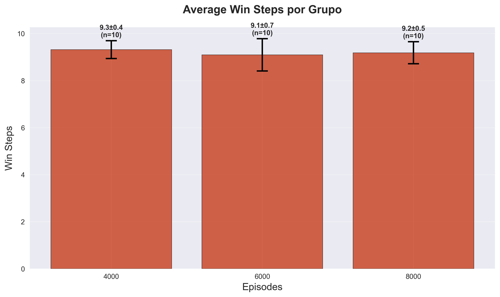
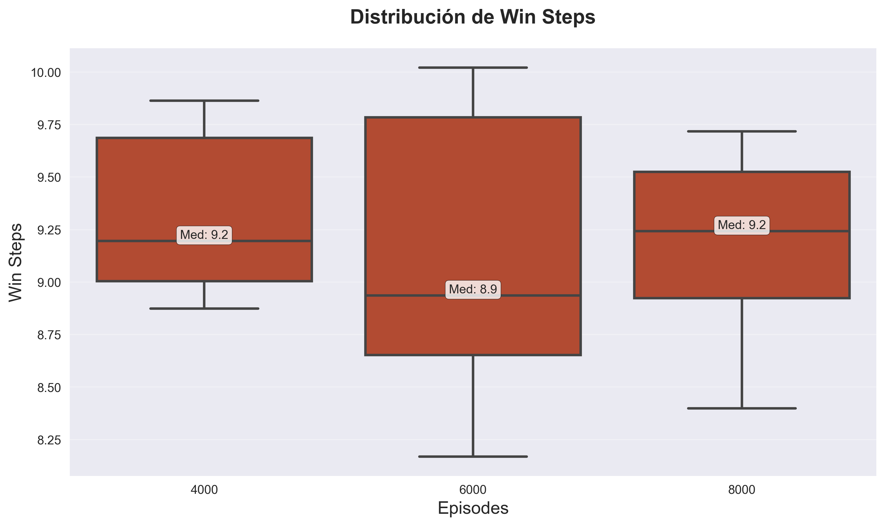
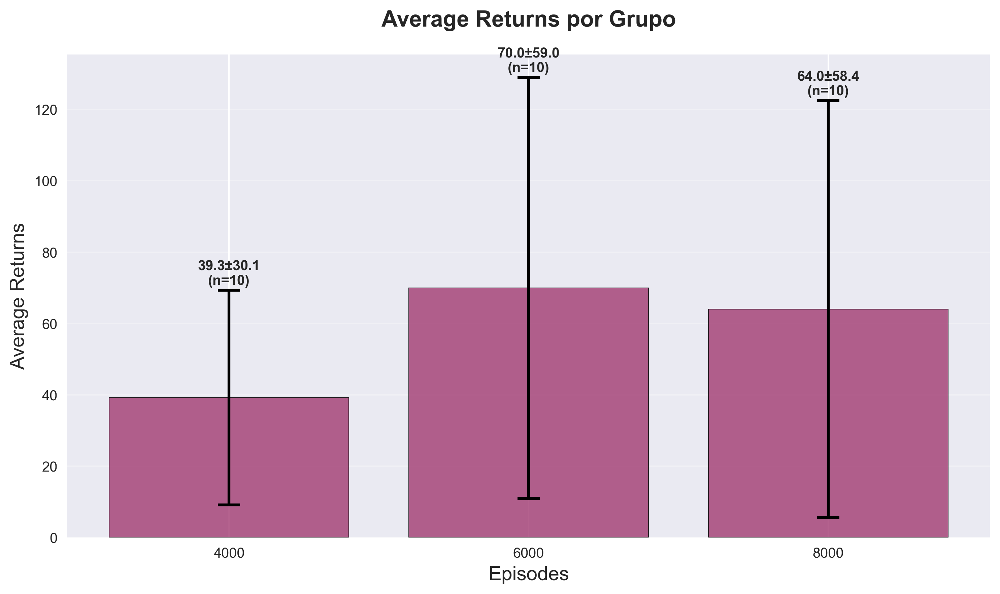
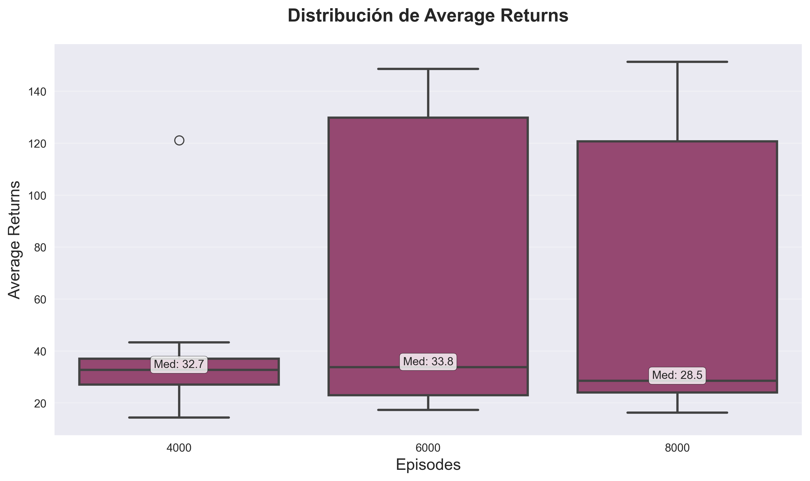
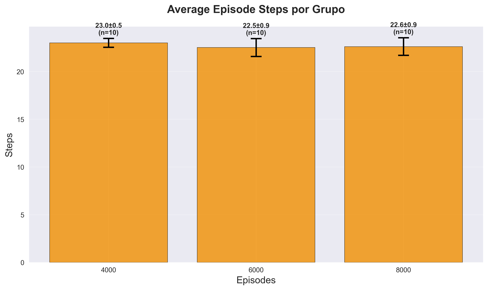
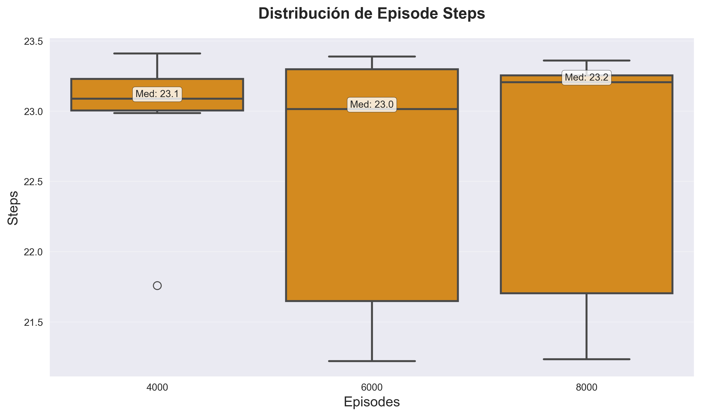
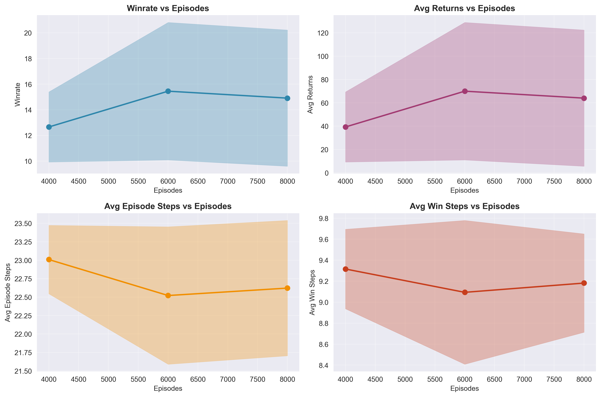

# Análisis de resultados experimentales del agente Q-Learning en escenario Tiny

## Resumen ejecutivo
Este análisis evalúa el rendimiento de un agente Q-learning entrenado en el escenario Tiny de NetSecGame bajo tres configuraciones de entrenamiento (4000, 6000 y 8000 episodios), con 10 ejecuciones independientes por configuración. Los resultados revelan patrones importantes sobre la evolución del aprendizaje, estabilidad y eficiencia del algoritmo.

## Variabilidad inherente en el aprendizaje por refuerzo

Las variaciones observadas en los resultados obtenidos por el agente de Q-learning en NetSecGame se deben en parte a la aleatoriedad introducida durante la inicialización de la Q-table con valores aleatorios. Esta inicialización estocástica puede afectar significativamente la exploración inicial del entorno, influenciando tanto la velocidad de convergencia como el retorno acumulado de cada episodio. Adicionalmente, el proceso de selección de acciones mediante la estrategia epsilon-greedy introduce elementos aleatorios durante todo el entrenamiento, lo que contribuye a la variabilidad observada en las métricas de rendimiento. Por este motivo, se realizaron múltiples ejecuciones independientes (n=10) para cada configuración experimental, promediando los resultados para obtener una evaluación más robusta y representativa del comportamiento del agente. Esta metodología permite distinguir entre la variabilidad inherente al algoritmo y las tendencias reales de aprendizaje, proporcionando mayor confianza estadística en las conclusiones extraídas.

## Winrate por cantidad de episodios

Una de las métricas más directas y relevantes para evaluar el rendimiento de un agente de aprendizaje por refuerzo es el porcentaje de victorias o winrate. Esta métrica indica con qué frecuencia el agente alcanza el estado objetivo dentro de un episodio, y sirve como una medida general del éxito del entrenamiento.

En la Figura 1, se observa una tendencia creciente en el winrate desde 4000 hasta 6000 episodios. 

*Figura X: Porcentaje promedio de victorias (winrate) alcanzado por un agente de Q-learning en el escenario tiny, evaluado tras 10 ejecuciones independientes para 4000, 6000 y 8000 episodios de entrenamiento. Las barras indican el valor medio y las líneas negras representan la desviación estándar. Se observa una mejora inicial del rendimiento al aumentar los episodios, con una leve estabilización a partir de los 6000 episodios.*

Esto indica que el rendimiento del agente mejora al aumentar la cantidad de episodios de entrenamiento de 4000 a 6000, lo que sugiere que el agente está aprendiendo de manera efectiva durante ese intervalo.

**Indicios de estancamiento**

Al comparar 6000 y 8000 episodios, se aprecia que el winrate apenas varía (15.5 % vs. 14.9 %), y además la diferencia está dentro del margen de error. Esto podría indicar un estancamiento o saturación del aprendizaje, donde añadir más episodios no contribuye significativamente a mejorar el rendimiento.

**Variabilidad y estabilidad**

Las barras de error son considerables en los tres casos, pero se amplifican al aumentar la cantidad de episodios

### Distribución de WinRate

*Figura X: Boxplot del porcentaje de victorias (winrate (%)) obtenidas por un agente de Q-learning tras 10 ejecuciones independientes por cada grupo de entrenamiento (4000, 6000 y 8000 episodios) en el escenario tiny. La mediana está resaltada en cada caja. Si bien algunos agentes logran mejores resultados con más entrenamiento, la mediana permanece estable y la variabilidad aumenta con la cantidad de episodios.*

El gráfico muestra boxplots del porcentaje de victorias (winrate (%)) obtenido por el agente tras ser entrenado durante 4000, 6000 y 8000 episodios, a lo largo de 10 ejecuciones independientes por grupo.

- 4000 episodios: Mediana ≈ 12.1 %
- 6000 episodios: Mediana ≈ 12.2 %
- 8000 episodios: Mediana ≈ 11.7 %

A simple vista, las medianas son muy similares entre los tres grupos, lo que sugiere que, en términos de desempeño central, no hay una mejora sustancial con el aumento de episodios.

**Dispersión y estabilidad**

El grupo de 4000 episodios presenta una distribución estrecha y estable, con baja variabilidad entre ejecuciones.

En contraste, los grupos de 6000 y 8000 episodios muestran una mayor dispersión, con rangos que llegan hasta valores cercanos al 22 % y mínimos cercanos al 10 %.

En el grupo de 4000 se observa un valor atípico alto (outlier), lo que podría ser una ejecución particularmente exitosa, aunque no representa la tendencia general.

## Win Steps por cantidad de episodios

Resulta relevante analizar la eficiencia con la que logra sus objetivos, es decir, cuántos pasos necesita, en promedio, para alcanzar una victoria. Esta métrica permite evaluar si el agente no solo aprende a ganar, sino si además optimiza su comportamiento en el proceso de entrenamiento.
En esta sección se presenta la evolución de la métrica average_win_steps.
El análisis busca determinar si el incremento en la cantidad de episodios tiene un impacto significativo en la capacidad del agente para alcanzar la meta en menos pasos, reflejando un aprendizaje más efectivo y estratégico.

*Figura Y: Promedio de pasos requeridos para alcanzar una victoria (average win steps) por un agente de Q-learning entrenado durante 4000, 6000 y 8000 episodios en el escenario tiny. Cada valor representa el promedio de 10 ejecuciones independientes, con su respectiva desviación estándar. Se observa una ligera variación entre los grupos, aunque dentro de márgenes similares, lo que indica una alta consistencia en el comportamiento del agente una vez que aprende a ganar.*

Los valores medios observados son muy similares entre los tres grupos:

- 4000 episodios: 9.3 pasos ± 0.4

- 6000 episodios: 9.1 pasos ± 0.7

- 8000 episodios: 9.2 pasos ± 0.5

Esta estabilidad en la métrica sugiere que, independientemente del número total de episodios de entrenamiento, el agente tiende a requerir una cantidad de pasos bastante constante para ganar una vez que ha aprendido una estrategia efectiva.

Una disminución en la cantidad de pasos promedio para ganar puede interpretarse como una señal de mejora en la eficiencia del agente (es decir, alcanza la meta más rápido). Sin embargo, en este caso, la diferencia entre los valores es mínima y estadísticamente poco significativa, ya que todas las medias se encuentran dentro del margen de error de las demás.

Si bien el promedio de pasos necesarios para alcanzar una victoria permite evaluar la eficiencia general del agente, es importante también observar cómo se distribuyen estos valores a lo largo de las ejecuciones independientes. Para ello, se emplea un boxplot, que ofrece una visualización más completa de la variabilidad, identificando no solo la mediana, sino también la dispersión, los cuartiles y posibles valores atípicos.

*Figura X: Boxplot de la cantidad de pasos necesarios para alcanzar una victoria (win steps) por parte de un agente de Q-learning en el escenario tiny. Se muestran los resultados de 10 ejecuciones por grupo de entrenamiento (4000, 6000 y 8000 episodios). La mediana se indica en cada caja. El grupo de 6000 episodios presenta mayor dispersión, mientras que los grupos de 4000 y 8000 muestran un comportamiento más consistente.*

**Tendencia central (mediana)**

- 4000 episodios: Mediana ≈ 9.2
- 6000 episodios: Mediana ≈ 8.9
- 8000 episodios: Mediana ≈ 9.

La mediana de 6000 episodios es ligeramente menor, lo que sugiere que en ese grupo, el agente, en promedio, logra ganar con menos pasos. Sin embargo, la diferencia es sutil y no necesariamente estadísticamente significativa.

**Dispersión**

El grupo de 6000 episodios presenta la mayor dispersión, con un rango más amplio (desde aproximadamente 8.1 hasta 10), lo que indica una mayor variabilidad en el desempeño del agente en diferentes ejecuciones.

En contraste, los grupos de 4000 y 8000 episodios presentan una distribución más compacta y consistente, aunque en el caso de 8000 episodios hay algunos valores bajos que podrían estar influyendo.

## Returns por episodio

Los retornos promedio (average returns) constituyen una métrica fundamental en el aprendizaje por refuerzo, ya que reflejan la recompensa acumulada que obtiene el agente a lo largo de un episodio completo. Esta métrica proporciona una visión integral del rendimiento del agente, capturando no solo si alcanza el objetivo (como lo hace el winrate), sino también la eficiencia y calidad del proceso de aprendizaje durante todo el episodio.

En el contexto del escenario Tiny, los retornos promedio ofrecen información valiosa sobre cómo evoluciona la capacidad del agente para maximizar las recompensas obtenidas, considerando tanto los episodios exitosos como los fallidos. A diferencia del winrate, que es una métrica binaria (éxito/fracaso), los retornos promedio permiten evaluar matices en el rendimiento, como la mejora gradual en las estrategias adoptadas y la optimización de las secuencias de acciones.

El análisis de esta métrica resulta especialmente relevante para determinar el punto óptimo de entrenamiento, ya que valores más altos de retornos promedio indican que el agente no solo está aprendiendo a completar la tarea, sino que lo hace de manera más eficiente y consistente.

*Figura X:  Promedio de retornos por un agente de Q-learning entrenado durante 4000, 6000 y 8000 episodios en el escenario tiny. Los resultados muestran que el entrenamiento hasta 6000 episodios produce el mejor rendimiento promedio, con alta variabilidad inter-ejecución evidenciada por las amplias barras de error.*

**Tendencia general** 

- 4000 episodios: 39.3 ± 30.1 average returns
- 6000 episodios: 70.0 ± 59.0 average returns (+78% de mejora)
- 8000 episodios: 64.0 ± 58.4 average returns (ligera disminución del 8.6%)

**Observaciones clave:**

- Mejora sustancial inicial: El salto de 4000 a 6000 episodios produce una mejora dramática de casi el 80%, indicando que el agente desarrolla estrategias significativamente más efectivas.

- Alta variabilidad: Los resultados son inconsistentes entre ejecuciones, especialmente con más entrenamiento.

La Figura X, presenta la distribución de los retornos promedio (average returns) para las tres configuraciones de entrenamiento (4000, 6000 y 8000 episodios), mostrando las medianas, cuartiles, rangos intercuartílicos y valores atípicos de las 10 ejecuciones independientes por grupo.

*Figura X:  Boxplots de retornos promedio del agente Q-learning mostrando el comportamiento de rendimiento. La configuración de 6000 episodios alcanza la mediana más alta (33.8) pero con máxima variabilidad, mientras que 8000 episodios presenta degradación del rendimiento central (mediana: 28.5) manteniendo alta dispersión.*

**Tendencia central**

Medianas comparadas:

- 4000 episodios: 32.7
- 6000 episodios: 33.8 
- 8000 episodios: 28.5 

Las medianas muestran un patrón similar al observado en las medias, con mejora hasta 6000 episodios seguida de deterioro a 8000 episodios.

## Steps por episodio

La Figura X, muestra la evolución del número promedio de pasos por episodio (average episode steps) del agente Q-learning en el escenario Tiny, comparando tres configuraciones de entrenamiento: 4000, 6000 y 8000 episodios. Cada barra representa la media de 10 ejecuciones independientes con barras de error indicando la desviación estándar.

*Figura X: Promedio de steps realizados por un agente de Q-learning entrenado durante 4000, 6000 y 8000 episodios en el escenario tiny. Se observa convergencia hacia un valor estable de ~22.5 pasos por episodio.*

Valores observados:

- 4000 episodios: 23.0 ± 0.5 pasos promedio
- 6000 episodios: 22.5 ± 0.9 pasos promedio 
- 8000 episodios: 22.6 ± 0.9 pasos promedio 

Se observa una convergencia hacia un valor alrededor de 22.5-23.0 pasos por episodio. 

La Figura X,  la distribución del número de pasos por episodio (episode steps) para las tres configuraciones de entrenamiento del agente Q-learning en el escenario Tiny, proporcionando una visión detallada de la variabilidad y consistencia en la duración de los episodios.

*Figura X: Boxplot de episode steps por número de episodios de entrenamiento. Las medianas se mantienen estables alrededor de 23 pasos, evidenciando convergencia del agente hacia comportamientos estructuralmente consistentes.*

**Tendencias centrales**

- 4000 episodios: 23.1 pasos
- 6000 episodios: 23.0 pasos 
- 8000 episodios: 23.2 pasos 

Las medianas se mantienen notablemente estables alrededor de 23.0-23.2 pasos, confirmando la convergencia hacia un comportamiento óptimo consistente.

Mientras los returns muestran alta variabilidad, los episode steps demuestran estabilidad y predictibilidad, sugiriendo que el agente logra consistencia en la estructura del comportamiento aunque no siempre en la calidad de las recompensas.

## Evolución de métricas de rendimiento por episodios

La Figura X, presenta cuatro gráficos de líneas que muestran la evolución temporal de diferentes métricas de rendimiento del agente Q-learning en el escenario Tiny. Cada gráfico incluye bandas de confianza (áreas sombreadas) que representan la variabilidad entre las 10 ejecuciones independientes.

*Figura X: Evolución de métricas de rendimiento del agente Q-learning en función de episodios de entrenamiento.*

El agente mejora significativamente su tasa de éxito (winrate) hasta 6000 episodios, pero no logra mantener esa mejora con entrenamiento adicional, sugiriendo un punto óptimo alrededor de 6000 episodios.

Con respecto a la metrica avg returns, la misma muestra la mayor sensibilidad al entrenamiento y confirma el patrón de mejora hasta 6000 episodios seguida de degradación, con alta variabilidad que indica inconsistencia en el rendimiento.

La métrica avg episode steps, resulto ser la más estable y consistente, indicando que el agente desarrolla comportamientos consistentes independientemente de la efectividad en recompensas.

Finalmente, con respecto a la metrica avg win steps, el agente desarrolla estrategias eficientes para episodios exitosos que se mantienen consistentes, sugiriendo que cuando el agente gana, lo hace de manera óptima y reproducible.

