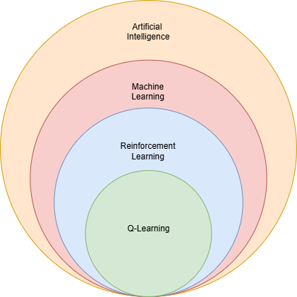

# Inteligencia Artificial

De acuerdo con Stuart Russell y Peter Norvig [1], la Inteligencia Artificial se define formalmente como la disciplina de la ciencia de la computación que estudia el diseño, la implementación y la evaluación de agentes racionales.

En este contexto, un agente se define como un sistema computacional que:

- **Percibe** su entorno a través de sensores.

- **Ejecuta** acciones sobre dicho entorno mediante actuadores.

- Opera de forma **autónoma** para cumplir un objetivo designado.

La contribución central de este enfoque no es la simple imitación del pensamiento o comportamiento humano (un estándar difícil de medir y no siempre óptimo), sino la racionalidad. Un agente es considerado racional si, para cualquier secuencia de percepciones dada, selecciona la acción que se espera maximice su medida de rendimiento (o función de utilidad). Esta decisión se fundamenta en la evidencia provista por la secuencia de percepciones y en cualquier conocimiento previo que el agente posea.

Este enfoque en la "racionalidad de la acción" proporciona el fundamento teórico directo para el Aprendizaje por Refuerzo (reinforcement learning).

Como muestra la Figura 1, el Aprendizaje Automático (Machine Learning) es un subcampo de la IA que estudia la capacidad de mejorar el rendimiento basándose en la experiencia. Según la definición canónica de Tom M. Mitchell [2], el Aprendizaje Automático se define de la siguiente manera: "Se dice que un programa de computadora aprende de la experiencia E con respecto a alguna clase de tareas T y una medida de rendimiento P, si su rendimiento en las tareas T, medido por P, mejora con la experiencia E". El Aprendizaje por Refuerzo es un subcampo del Aprendizaje Automático que aborda precisamente el problema de cómo un agente debe actuar en un entorno para maximizar una noción de recompensa acumulativa, constituyendo así una implementación concreta del paradigma del agente racional en entornos secuenciales de decisión. De acuerdo con Sutton y Barto [3], el Aprendizaje por Refuerzo (RL) es un enfoque computacional para el aprendizaje basado en la interacción. 

*Figura 1: Jerarquía de inteligencia artificial, aprendizaje automático, aprendizaje por refuerzo y q-learning.*

A diferencia de otros paradigmas de aprendizaje automático, un agente de RL no recibe instrucciones sobre qué acciones tomar, sino que debe descubrir mediante prueba y error qué acciones producen la mayor recompensa, aprendiendo a mapear situaciones en acciones para maximizar una señal de recompensa numérica.

Para formalizar matemáticamente el problema de la toma de decisiones secuencial que el Aprendizaje por Refuerzo aborda, se utiliza el marco de los Procesos de Decisión de Markov (Markov Decision Problems, MDPs).

Un MDP es un modelo estocástico de control en tiempo discreto que formaliza la interacción entre el agente y el entorno. Prácticamente todos los problemas de RL pueden ser enmarcados como un MDP [3].

Un MDP se define formalmente como una 5-tupla $(S, A, P, R, \gamma)$:
- $S$ (Estados): Un conjunto finito de estados que el agente puede percibir.
- $A$ (Acciones): Un conjunto finito de acciones que el agente puede ejecutar.
- $P$ (Función de Transición): La dinámica del entorno, o el "modelo" (previamente mencionado). Define la probabilidad de transitar al estado $s'$ después de tomar la acción $a$ en el estado $s$. Se expresa como:$$P(s' | s, a) = \Pr(S_{t+1} = s' | S_t = s, A_t = a)$$
- $R$ (Función de Recompensa): Especifica la recompensa $R_t$ que el agente recibe. Formalmente, es el valor esperado de la recompensa al transitar al estado $s'$ desde el estado $s$ tomando la acción $a$.
- $\gamma$ (Factor de Descuento): Un escalar $0 \le \gamma \le 1$ que pondera la importancia de las recompensas futuras frente a las inmediatas.

La característica que define este marco es la Propiedad de Markov. Un entorno posee esta propiedad si las transiciones y recompensas futuras dependen únicamente del estado actual $S_t$ y la acción $A_t$, y no de la secuencia de eventos pasados que condujeron a ese estado. En un MDP, el estado $S_t$ es una representación suficiente de toda la historia del agente.

Según Sutton y Barto, casi todos los problemas de RL pueden formalizarse utilizando cuatro componentes esenciales que interactúan entre sí:

1. **Política** (Policy): Define el comportamiento del agente en un momento dado. Es una correspondencia (o mapeo) entre los estados percibidos del entorno y las acciones a tomar en dichos estados.
2. **Señal de recompensa** (Reward Signal): Es la base del objetivo del agente. En cada paso de tiempo, el entorno envía al agente un número escalar $R_t$ (la recompensa). El objetivo único del agente es maximizar la recompensa acumulativa total a largo plazo. La señal de recompensa define qué eventos son "buenos" y "malos" para el agente de manera inmediata.
3. **Función de valor** (Value Function): Mientras que la recompensa indica lo que es bueno en el sentido inmediato, la función de valor especifica lo que es bueno a largo plazo. El valor de un estado, es la recompensa total acumulada que el agente espera recibir en el futuro, comenzando desde ese estado. Las funciones de valor son predicciones de recompensas futuras y son cruciales para tomar decisiones, ya que gestionan la disyuntiva entre la ganancia a corto y largo plazo. 
4. **Modelo** (Model, opcional): Es una representación interna que el agente tiene del entorno. Un modelo simula el comportamiento del entorno, permitiendo al agente predecir el próximo estado y la próxima recompensa basándose en el estado actual y la acción tomada. El algoritmo Q-learning, pilar de esta investigación, pertenece precisamente a esta categoría, operando como un método libre de modelo diseñado para estimar la función de valor óptima.

# Bibliografía 

1. Russell, S. & Norvig, P. (2021). Artificial Intelligence, Global Edition. (4th ed.). Pearson Education.
2. Mitchell, T. M. (1997). Machine Learning (Vol. 1). McGraw-Hill.
3. Sutton, R. S., Barto, A. G. (2018). Reinforcement Learning: An Introduction. The MIT Press.