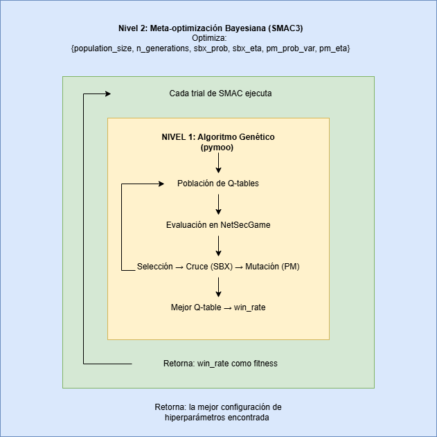

# Diseño y desarrollo del trabajo.

Esta sección presenta la metodología general seguida para el diseño y la ejecución del trabajo experimental sobre NetSecGame. En primer lugar, se justifica la elección de un enfoque de aprendizaje por refuerzo con representación basada en características (*feature-based*), seleccionado por su capacidad de generalización y por reducir la dimensionalidad del espacio de estados frente a representaciones tabulares puras. En segundo término, se describe el flujo de preprocesamiento de datos. La interpretación de resultados se centra en el *win rate* como métrica principal de desempeño, entendido como la proporción de episodios en los que el agente alcanza el objetivo definido en el entorno bajo un presupuesto de pasos dado. Finalmente, se detallan las tecnologías y librerías utilizadas para implementar, automatizar y monitorear los experimentos.

## Representación de estados basada en características (Feature Based) para agente Q-Learning

En esta sección se presenta la modificación aplicada al algoritmo Q-Learning mediante la implementación de una representación de estados basada en características (*feature-based*) para mejorar el desempeño del agente en NetSecGame. La propuesta aborda las limitaciones del mapeo directo estado-identificador, introduciendo una abstracción que permite la generalización entre estados similares y reduce la complejidad del espacio de estados. 

Se postula que la implementación de una representación basada en características permitirá al agente Q-Learning:
- Generalizar el conocimiento adquirido entre estados funcionalmente equivalentes
- Reducir el tiempo de convergencia del algoritmo
- Mantener o mejorar la calidad de las políticas aprendidas

La transición hacia una representación basada en características no solo obedece a la necesidad de comprimir el espacio de estados, sino que constituye un prerrequisito estructural ineludible para posibilitar la aplicación integral de algoritmos genéticos en el aprendizaje y evolución de políticas. Bajo la representación directa original, la explosión combinatoria del espacio de estados tornaba computacionalmente prohibitivo que un individuo genético (cromosoma) lograra codificar una matriz estado-acción robusta y susceptible de ser entrenada.

Una vez establecida una representación adecuada y dimensionalmente controlable, el propósito recae en la aplicación de la metodología **ReLIEF** [29, 30]. Este es un enfoque metodológico propuesto recientemente para inicializar de forma informada la tabla Q (lo que previamente se definió como un enfoque de *warm-start*), apalancándose en las propiedades exploratorias de la computación y algoritmos evolutivos [31, 32, 33]. Este marco ha sido validado y adaptado exitosamente a problemas heurísticos complejos como los desafíos de autoescalado [34, 35, 36].

En este contexto, la idea central del trabajo adopta el marco ReLIEF para aplicar técnicas de computación evolutiva que exploren y evalúen políticas iniciales en el entorno simulado de ciberseguridad NetSecGame. Como resultado, se obtiene una tabla Q preentrenada que reduce la exploración inicial no informada y acelera el aprendizaje secuencial del agente atacante en NetSecGame.

### Arquitectura del Agente

La solución implementada consta de dos componentes principales:

- **Extractor de características (FeatureExtractor)**: módulo que toma el estado provisto por NetSecGame (originalmente expresado como una representación textual/estructurada del entorno) y lo transforma en un vector numérico de dimensión fija. Este vector resume, en forma de conteos agregados, la información relevante para la toma de decisiones (por ejemplo, para el caso de 4 subredes descubiertas, 10 hosts conocidos, 4 hosts controlados, 10 servicios observados y 3 datos encontrados, el vector resultante es [4, 10, 4, 10, 3]). 
    
    El vector de características definido captura cinco dimensiones fundamentales del estado del entorno:

    $$\mathbf{f}(s) = [n_{redes}, n_{hosts\_conocidos}, n_{hosts\_controlados}, n_{servicios}, n_{datos}]$$

    Donde:
    - $n_{redes}$: Cantidad de subredes descubiertas
    - $n_{hosts\_conocidos}$: Total de hosts identificados en el entorno  
    - $n_{hosts\_controlados}$: Número de hosts bajo control del atacante
    - $n_{servicios}$: Suma de servicios detectados en todos los hosts
    - $n_{datos}$: Total de elementos de datos encontrados

- **Agente Q-Learning modificado**: componente de aprendizaje que reemplaza el identificador de estado “literal” por el vector de características. En cada paso del episodio, el agente (i) obtiene el estado del entorno, (ii) calcula su representación feature-based, (iii) utiliza ese vector como clave de estado en la Q-table y (iv) selecciona y ejecuta una acción según su política, actualizando luego $Q(s,a)$ en función de la recompensa y el siguiente estado.

En términos operativos, el flujo puede resumirse como: 

**NetSecGame → estado → FeatureExtractor → vector de características → Q-table/política → acción → NetSecGame**. 

Esta separación permite desacoplar la lógica de representación del estado de la lógica de aprendizaje, y habilita el uso de estrategias de *warm-start* (como ReLIEF) para inicializar la Q-table de manera informada antes del entrenamiento en línea.

---

## Preprocesamiento de datos

Tras la integración de la representación basada en características (feature-based), la fase de preprocesamiento se centró en la preparación de los componentes fundamentales para la construcción de las tablas Q que serían sometidas a optimización. El objetivo principal de esta etapa es definir con precisión las dimensiones de la matriz (el conjunto de estados y acciones) para que el framework de optimización —orquestado mediante la integración de SMAC y pymoo— pueda generar, poblar y evolucionar las políticas candidatas de manera estructurada.

La conformación de este espacio de búsqueda se dividió en dos procesos de extracción diferenciados:

- Extracción del Espacio de Estados: La recopilación de los estados factibles se llevó a cabo mediante un módulo de desarrollo propio. Este componente analiza y extrae los estados empíricamente visitados a partir de una tabla Q de referencia, la cual fue generada previamente mediante ejecuciones estándar del algoritmo Q-Learning. Este enfoque garantiza que el optimizador trabaje exclusivamente sobre estados relevantes y alcanzables dentro del entorno.

- Mapeo del Espacio de Acciones: Para definir el conjunto de acciones disponibles, se integró el componente WhiteBoxNSGCoordinator. Esta extensión del entorno NetSecGame opera bajo un enfoque de caja blanca, proporcionando visibilidad total sobre las mecánicas subyacentes y permitiendo extraer un listado exhaustivo de todas las acciones legales y posibles para cada agente registrado en la simulación.

---

## Estrategia de Optimización en Dos Niveles

Esta etapa tiene como objetivo **inicializar de manera informada** una política (tabla Q) antes del aprendizaje en línea, utilizando un esquema de optimización en dos niveles: (i) un **algoritmo genético** implementado con *pymoo* para optimizar los valores de la Q-table dentro de un espacio de estados y acciones ya definido, y (ii) una **optimización bayesiana** con *SMAC* para seleccionar automáticamente los hiperparámetros del algoritmo genético que mejor rendimiento producen.

*Figura: Esquema del proceso de optimización propuesto. SMAC3 (nivel externo) selecciona configuraciones de hiperparámetros y, para cada *trial*, ejecuta un algoritmo genético en *pymoo* (nivel interno) que evalúa Q-tables en NetSecGame usando el *win rate* como métrica de aptitud.*

Como muestra la figura, el flujo se organiza como un bucle anidado: **SMAC3** propone una configuración de hiperparámetros y dispara una ejecución del **GA**. El GA genera y refina una población de Q-tables, las evalúa en el entorno y retorna el mejor *win rate* alcanzado. Ese resultado se utiliza como retroalimentación para que SMAC3 actualice su modelo y proponga nuevas configuraciones, hasta identificar la combinación de hiperparámetros que maximiza el rendimiento observado.

### 1. Definición del Espacio de Búsqueda (Matriz Q)

El preprocesamiento detallado en la sección anterior establece los límites estrictos del espacio de búsqueda de la política, conformando dos conjuntos finitos:

- **Conjunto de estados $\mathcal{S}$**: obtenido a partir de estados empíricamente visitados (extraídos de una Q-table de referencia).
- **Conjunto de acciones $\mathcal{A}$**: derivado del listado exhaustivo de acciones legales del entorno (mediante el coordinador de caja blanca).

Bajo este esquema, la tabla Q se define formalmente como una matriz de dimensiones $|\mathcal{S}| \times |\mathcal{A}|$, donde cada candidato a política se reduce a asignar valores a los pares $(s,a)$ dentro de ese espacio fijo:

$$Q: \mathcal{S} \times \mathcal{A} \to \mathbb{R}$$

Esta delimitación arquitectónica garantiza que el optimizador evolutivo no genere estados anómalos ni acciones inválidas, sino que explore distribuciones de inicialización para los valores $Q(s,a)$ sobre un dominio controlado, determinista y comparable entre distintos experimentos.

### 2. Nivel 1: optimización genética con *pymoo* (GA)

En el nivel interno, el framework *pymoo* ejecuta un algoritmo genético (GA) donde:

- **Cada individuo** representa una **Q-table completa** (es decir, una asignación de valores $Q(s,a)$ para todos los pares del espacio preprocesado).
- El GA genera una **población inicial** de individuos y aplica iterativamente operadores de búsqueda para proponer nuevas políticas candidatas. En particular, se utilizaron los siguientes mecanismos típicos de algoritmos genéticos con variables reales:
  - **Inicialización (FloatRandomSampling)**: crea la población inicial muestreando aleatoriamente valores reales dentro de los límites definidos para cada variable de decisión. En este trabajo, esto se traduce en generar Q-tables iniciales diversas asignando valores $Q(s,a)$ dentro de un rango acotado, lo que favorece la exploración temprana del espacio de políticas.
  - **Cruzamiento (SBX, *Simulated Binary Crossover*)**: operador de recombinación para representación real que combina dos individuos “padre” produciendo descendientes con valores interpolados entre ambos (con una dispersión controlada por sus parámetros). Su rol es explotar información parcial de soluciones prometedoras sin perder continuidad en el espacio de búsqueda.
  - **Mutación (PM, *Polynomial Mutation*)**: operador que introduce perturbaciones controladas en variables reales de un individuo. Mantiene diversidad en la población y permite escapar de óptimos locales al modificar, de forma probabilística, algunos valores $Q(s,a)$.
- Para cada individuo, se realiza una **evaluación empírica** ejecutando episodios de prueba en NetSecGame utilizando esa Q-table como política estática.

El desempeño de cada individuo se resume con el *win rate*, definido como:

$$\text{win rate} = \frac{\#\text{episodios ganados}}{\#\text{episodios evaluados}}$$

Este valor se utiliza como **función de aptitud (fitness)** del algoritmo genético: a mayor *win rate*, mejor es la Q-table candidata. Al finalizar las generaciones definidas, el GA retorna el mejor individuo observado, que constituye una **tabla Q preentrenada (warm-start)**.

### 3. Nivel 2: optimización bayesiana con *SMAC* (meta-optimización del GA)

El rendimiento del GA depende fuertemente de sus hiperparámetros (por ejemplo, tamaño de población, número de generaciones y parámetros de cruzamiento/mutación). En lugar de fijarlos manualmente, se emplea *SMAC* para optimizarlos de forma automática.

El procedimiento puede describirse como un bucle externo:

1. *SMAC* propone una configuración candidata de hiperparámetros del GA (definida en un espacio de configuración mediante *ConfigSpace*).
2. Se instancia y ejecuta el Algoritmo Genético de pymoo utilizando dicha configuración sobre la matriz Q preprocesada (manteniendo $S$ y $A$ invariables).
3. Se observa el mejor *win rate* alcanzado por el GA y se devuelve como resultado del *trial*.
4. *SMAC* actualiza su modelo probabilístico (modelo sustituto) con la evidencia recolectada y selecciona una nueva configuración para el siguiente *trial*.

En síntesis, *SMAC* no optimiza directamente la Q-table, sino que optimiza **cómo** se realiza la búsqueda genética, maximizando el *win rate* que el GA es capaz de obtener en el presupuesto de evaluación disponible.

En resumen, la arquitectura de inicialización propuesta opera bajo el siguiente flujo secuencial:

- **Preprocesamiento**: define $\mathcal{S}$ y $\mathcal{A}$ → fija la estructura $|\mathcal{S}| \times |\mathcal{A}|$.
- **GA (*pymoo*)**: propone y evalúa Q-tables (valores $Q(s,a)$) → retorna la mejor tabla según *win rate*.
- **SMAC**: prueba distintas configuraciones del GA → aprende cuáles producen mejores Q-tables → selecciona la configuración incumbente.

De esta forma, el resultado final del proceso es doble: (i) una **configuración recomendada** de hiperparámetros del GA y (ii) una **Q-table optimizada** que se utiliza como punto de partida para los experimentos de entrenamiento y/o validación.

---
## Entorno Tecnológico
### Herramientas y tecnologías utilizadas 

En esta sección se detallan las herramientas de software adoptadas para el desarrollo experimental. La selección tecnológica se fundamentó en la necesidad de garantizar la interoperabilidad con el framework principal, NetSecGame, y asegurar una implementación eficiente. Se adoptó Python como lenguaje de programación central debido a su robusta compatibilidad con el entorno de simulación y su extenso ecosistema orientado a la optimización computacional.

1. Entorno de Desarrollo y Gestión de Proyecto

- Visual Studio Code: Empleado como entorno de desarrollo integrado (IDE) principal para la codificación, estructuración y depuración del proyecto.

- Git y GitHub: Implementados como sistema de control de versiones y repositorio remoto, respectivamente, garantizando la trazabilidad y el resguardo de la evolución del código fuente.

- Conda: Utilizado para la creación y administración de entornos virtuales, asegurando el aislamiento de las dependencias y la reproducibilidad del entorno de ejecución.

2. Lenguaje Base y Librerías del Sistema

El proyecto fue desarrollado utilizando Python (versión 3.12.0). Para la gestión a nivel de sistema e interacción con el intérprete se integraron las siguientes librerías estándar:

- sys y subprocess: Utilizados para el control de la ejecución del proceso, manejo de interrupciones y la invocación de comandos del sistema operativo subyacente.

- argparse: Implementado para la gestión e ingesta dinámica de argumentos mediante línea de comandos.

- time: Empleado para la medición precisa de los tiempos de ejecución de los algoritmos.

- pickle: Encargado de la serialización y deserialización de estructuras de datos persistentes, fundamentalmente para guardar y cargar las Q-tables resultantes de los entrenamientos.

3. Computación Científica y Lógica de Aprendizaje

- numpy: Principal motor para la ejecución eficiente de cálculos matriciales, numéricos y estadísticos.
- random: Utilizado para la generación de números pseudoaleatorios, una pieza fundamental en la implementación de la política de exploración $\epsilon$-greedy.

4. Frameworks de Optimización

- SMAC y ConfigSpace: Integrados en conjunto para llevar a cabo la optimización bayesiana de los hiperparámetros del modelo.

- pymoo: Utilizado como framework de optimización heurística para la ejecución de un algoritmo genético enfocado en la mejora de las políticas (Q-tables).

5. Monitorización y Visualización de Resultados

- logging: Configurado para generar un registro detallado de los eventos de ejecución y depuración.

- mlflow: Implementado para la monitorización avanzada, permitiendo el registro, seguimiento y comparación de métricas y parámetros a lo largo de los distintos experimentos.

- matplotlib: Herramienta encargada de la generación de gráficas 2D para el análisis visual de los resultados obtenidos.

### Recursos de Hardware

La ejecución de las fases de entrenamiento, optimización de hiperparámetros y validación fue posible gracias a la infraestructura de cómputo de alto rendimiento provista por el Laboratorio de Sistemas Inteligentes (LABSIN https://labsin.org/es.html). El uso de estos recursos especializados garantizó la continuidad operativa de las pruebas, permitiendo mantener ejecuciones prolongadas y estables bajo cargas de procesamiento intensivas. Las especificaciones técnicas del nodo de cómputo utilizado se detallan en la Tabla N.

| Componente | Descripción | 
|----------|----------|
| Procesador | Intel(R) Core(TM) i7-7700 CPU @ 3.60GHz |
| Sistema Operativo | Ubuntu 20.04.6 LTS |
| GPU | NVIDIA GeForce GTX 1080 Ti |
| Memoria RAM | 64GB |

---

## Diseño de los Experimentos

