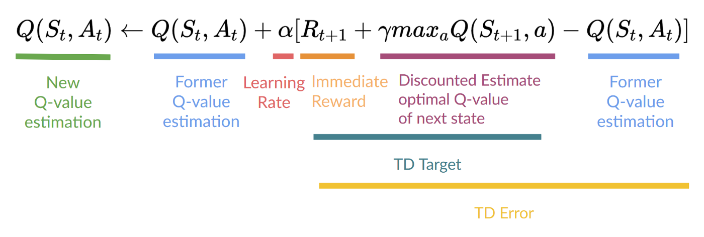
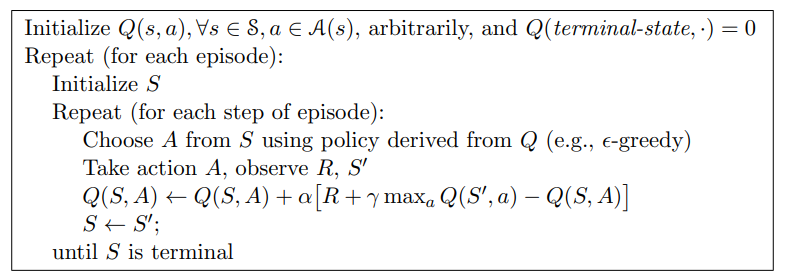
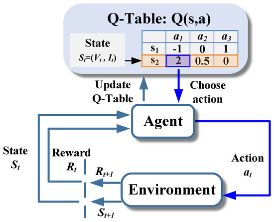

# Técnicas fundamentales de inicialización de Q-Tables en el aprendizaje por refuerzo

## Resumen ejecutivo

Q-Learning es un algoritmo central en el aprendizaje por refuerzo sin modelo, ampliamente utilizado para resolver problemas de toma de decisiones secuenciales en entornos inciertos. Su objetivo principal es permitir que un agente aprenda una política óptima —es decir, una estrategia de acciones que maximice la recompensa acumulada— dentro de un Proceso de Decisión de Markov (MDP). Para lograrlo, el algoritmo mantiene una Q-Table, una estructura de datos que almacena los valores Q, los cuales representan la recompensa esperada al ejecutar una acción específica en un determinado estado y seguir una política óptima a futuro. Estos valores se actualizan iterativamente utilizando la ecuación de Bellman, lo que permite que el agente mejore progresivamente su comportamiento mediante prueba y error, sin necesidad de conocer previamente el modelo del entorno [1]. 

Un aspecto crítico del proceso es la inicialización de la Q-Table, ya que los valores asignados inicialmente determinan la estrategia de exploración temprana del agente y, en consecuencia, afectan la velocidad de convergencia y la eficacia del aprendizaje. Entre las técnicas más comunes se encuentran la inicialización con ceros, con valores aleatorios pequeños o con valores optimistas. Cada una de estas estrategias influye directamente en el equilibrio entre exploración y explotación, así como en la dinámica general del proceso de aprendizaje.

Este informe detallará estas técnicas, y sus fundamentos teóricos. 

## Ecuacion de actualizacion de Q-learning

El aprendizaje en Q-Learning es una de las implementaciones más influyentes del Aprendizaje por Diferencias Temporales (Temporal-Difference o TD Learning), como lo definen Sutton y Barto [2]. A diferencia de los métodos de Monte Carlo que esperan hasta el final de un episodio para actualizar el valor, el aprendizaje TD actualiza sus estimaciones en cada paso (un proceso llamado *bootstrapping*). Es un algoritmo off-policy, lo que significa que aprende el valor de la política óptima independientemente de la política que el agente esté siguiendo para explorar [1, 2]. Después de que el agente ejecuta una acción `a` en un estado `s`, observa la recompensa inmediata `r` y el nuevo estado `s'`, el valor `Q(s, a)` se actualiza utilizando una regla derivada de la ecuación de Bellman:

*Figura 1: Desglose de la Ecuación de Actualización de Q-Learning. La imagen ilustra los componentes de la regla de actualización de Q-Learning, incluyendo el Error de Diferencia Temporal (TD Error). Adaptado de "Deep Reinforcement Learning Course: Part 2", por T. Simonini, 2022, Hugging Face (https://huggingface.co/blog/deep-rl-q-part2).*

Un desglose detallado de sus componentes revela su lógica:

- $Q(s, a)$: Es la estimación actual del valor Q para el par estado-acción $(s, a)$.

- $\alpha$: La tasa de aprendizaje (learning rate), es un factor que determina el tamaño del paso para actualizar el valor Q. Un valor alto (cercano a 1) significa que el agente depende en gran medida de la experiencia más reciente, lo que podría resultar en un aprendizaje más rápido, pero menos estable. Un valor bajo (cercano a 0) significa que el agente actualiza los valores Q más lentamente, con un paso más pequeño según la nueva información, lo que puede resultar en un aprendizaje más estable, pero podría ser más lento en converger. 

- $r + \gamma \max_{a'} Q(s', a')$: Este término se conoce como el TD Target (Objetivo de Diferencia Temporal). Es una nueva estimación, más informada, del valor de $Q(s, a)$. Se compone de la recompensa real e inmediata $r$ y la estimación descontada del valor óptimo futuro, $\gamma \max_{a'} Q(s', a')$. El término $\max_{a'} Q(s', a')$ es la estimación del agente de la máxima recompensa acumulada que puede obtener desde el nuevo estado $s'$. Es este término de maximización el que hace que el algoritmo sea off-policy, ya que evalúa la optimalidad desde $s'$ sin importar qué acción se tomará realmente en el siguiente paso.

- $[r + \gamma \max_{a'} Q(s', a') - Q(s, a)]$: Esta diferencia es el TD Error (Error de Diferencia Temporal). Mide la discrepancia entre la nueva estimación (el TD Target) y la estimación antigua ($Q(s, a)$). El algoritmo actualiza el valor Q en una fracción $\alpha$ de este error, moviendo la estimación antigua hacia el objetivo.

En su forma más simple, conocida como Q-learning tabular, el algoritmo almacena todos los valores Q en una tabla o matriz de dimensiones $|S| \times |A|$, llamada Q-table.  Cada celda de la tabla, $Q(s, a)$, contiene la estimación actual de la calidad de tomar la acción $a$ en el estado $s$. El proceso algorítmico de Q-Learning presentado en la Figura 2, se puede resumir en el siguiente bucle de entrenamiento:

- Inicializar la Q-Table: Crear la tabla Q(S, A) para todos los pares estado-acción. (Aquí se aplican las técnicas de inicialización a cero, aleatoria, u optimista descritas en la siguiente sección).

- Elegir una acción: Para el estado actual S, seleccionar una acción A usando una política (ej. Epsilon-Greedy) que balancee exploración y explotación.

- Realizar la acción: Ejecutar A, observar la recompensa R y el nuevo estado S'.

- Actualizar: Aplicar la regla de actualización de Q-Learning para el par Q(S, A).

*Figura 2: Pseudocódigo del algoritmo Q-Learning, detallando el bucle de interacción agente-entorno y la regla de actualización. Adaptado de Sutton y Barto [2].*

Para complementar el pseudocódigo, la Figura 3 representa de forma esquemática el ciclo de interacción agente-entorno y cómo este ciclo alimenta la actualización iterativa de la Q-Table.

*Figura 3: Esquema del ciclo de interacción en Q-Learning. El agente observa el estado actual, selecciona una acción basada en Q(s,a), recibe la recompensa y el nuevo estado del entorno, y actualiza la Q-Table en cada iteración.*

## Técnicas principales de inicialización de Q-tables

La inicialización de las funciones de valor, específicamente las Q-Tables, es un aspecto crucial que influye significativamente en la eficiencia y la rapidez de convergencia del aprendizaje [2]. La estrategia de inicialización determina la postura inicial del agente frente a la incertidumbre, impactando directamente su estrategia de exploración temprana. Se han establecido varias metodologías canónicas, que van desde enfoques neutrales (como la inicialización a ceros) hasta estrategias que fomentan activamente la exploración (como la inicialización optimista). Este apartado analiza las técnicas fundamentales y culmina con enfoques híbridos avanzados que buscan optimizar este punto de partida.

### Inicialización a ceros

Esta es la técnica de inicialización más directa y, por ende, la más común en la práctica del Q-Learning. Consiste en establecer todas las entradas de la Q-Table en un valor de cero [2]. La justificación de esta práctica radica en que, al inicio del proceso de aprendizaje, el agente carece de cualquier información o conocimiento sobre las recompensas esperadas de las acciones en los diferentes estados. Por lo tanto, un valor neutral de cero sirve como un punto de partida imparcial. 

Cuando todos los valores Q son cero, el agente no tiene una preferencia intrínseca por ninguna acción en un estado dado. En ausencia de otros mecanismos de exploración, esto puede llevar a que el agente elija acciones de manera puramente aleatoria. Esta aleatoriedad inicial es a menudo gestionada por políticas de exploración como la estrategia epsilon-greedy, donde el agente elige una acción aleatoria con una probabilidad ε.

Este sesgo, aunque no impide la convergencia a largo plazo en espacios de estados discretos si se garantiza suficiente exploración , puede afectar la eficiencia del aprendizaje inicial. Podría ralentizar el descubrimiento de rutas óptimas si la acción preferida por defecto no es la mejor, o si se necesitan múltiples exploraciones para corregir este sesgo inicial

### Inicialización con valores aleatorios

Una alternativa a la inicialización a ceros es establecer los valores Q iniciales como números aleatorios dentro de un rango limitado (por ejemplo, entre [-k, k] o [0, k], siendo k un valor real pequeño típicamente ≤ 0.5). Esta práctica se alinea con las recomendaciones de Sutton y Barto [2] donde señalan que:  

><em>“Initialize Q(s,a) arbitrarily…”</em>
- Donde "arbitrariamente" incluye explícitamente valores aleatorios pequeños 

Sus principales ventajas son romper la simetría inicial y prevenir preferencias prematuras hacia acciones específicas, fomentando exploración diversificada en etapas tempranas del aprendizaje. Al asignar valores ligeramente distintos a cada par estado-acción, se eliminan empates iniciales que ocurren con la inicialización a cero. Esto evita que el agente seleccione siempre la misma acción por defecto (ej: la primera en el orden de procesamiento) cuando múltiples acciones tienen valores idénticos.

### Inicialización optimista

La inicialización optimista es una técnica utilizada en el aprendizaje por refuerzo, específicamente en algoritmos de aprendizaje de valores como Q-learning. Consiste en asignar valores iniciales elevados a la función de valor acción-estado, Q(s,a), antes de que el agente comience a interactuar con el entorno. En otras palabras, se le da al agente una expectativa "optimista" sobre las recompensas futuras de todas las acciones en cualquier estado. Esto significa que el agente, al principio, creerá que cualquier acción que tome en un estado dado le reportará una recompensa muy alta.

La principal ventaja de este enfoque es que fomenta una exploración exhaustiva inicial. Incluso si el agente utiliza una política puramente codiciosa (greedy), que normalmente lo llevaría a explotar rápidamente las acciones que parecen más prometedoras, la inicialización optimista lo impulsa a probar todas las acciones suficientes veces. Esto ocurre porque todas las estimaciones iniciales de Q(s,a) son muy altas. Para que el agente "confíe" en que una acción es realmente peor que otra, debe explorar y experimentar recompensas reales que disminuyan su valor Q(s,a) estimado. Este comportamiento es fundamental para garantizar que no se pasen por alto acciones potencialmente óptimas, un concepto bien documentado por Sutton y Barto [2]. 

Sin embargo, la inicialización optimista introduce un hiperparámetro adicional: el nivel de optimismo, es decir, cuán alto se deben inicializar los valores de Q(s,a) [2,6]. Elegir el valor óptimo es crucial y depende del problema específico. Si el valor inicial es demasiado alto, el agente podría dedicar un tiempo excesivo a explorar acciones subóptimas, lo que ralentizaría la convergencia. Por el contrario, si es demasiado bajo, no se logrará una exploración inicial suficiente, y el agente podría converger prematuramente a una política subóptima. Una heurística común es inicializar Q(s,a) con un valor cercano al máximo teórico posible de la recompensa acumulada.

En entornos no estacionarios, donde las recompensas o las transiciones del entorno cambian con el tiempo, la inicialización optimista puede ser menos efectiva. El sesgo inicial puede persistir y dificultar la adaptación del agente a los cambios dinámicos del entorno. Si bien al inicio el agente puede experimentar recompensas subóptimas debido a la exploración excesiva de acciones aparentemente malas, este es un compromiso (trade-off) necesario para asegurar que no se ignoren acciones potencialmente buenas que, de otra manera, podrían haber sido pasadas por alto.

A diferencia de la inicialización a cero (donde todos los Q(s,a) se inicializan en 0) o la inicialización aleatoria, el sesgo optimista es deliberado y temporal. Se corrige a medida que el agente explora el entorno y actualiza sus estimaciones de Q(s,a). La inicialización aleatoria, por su parte, no garantiza una exploración uniforme, ya que algunas acciones podrían tener valores iniciales más altos por pura casualidad, lo que llevaría al agente a favorecerlas sin una exploración sistemática.

### Inicialización mediante evolución de políticas    

Una estrategia prometedora para acelerar el aprendizaje por refuerzo en entornos discretos consiste en inicializar las Q-tables a partir de políticas preentrenadas mediante algoritmos evolutivos. Este enfoque parte del supuesto de que, si se dispone de una política eficaz —obtenida mediante optimización evolutiva—, es posible utilizar su comportamiento como base para estimar valores iniciales Q(s, a), mejorando la calidad de la exploración en las primeras etapas de entrenamiento.

Este tipo de técnica se fundamenta en la complementariedad entre aprendizaje por refuerzo y algoritmos evolutivos, ampliamente discutida por Grefenstette et al. [3] y analizada en detalle en revisiones recientes como las de Bai et al. [4] y Li et al. [5]. En este contexto, la evolución de políticas actúa como una forma de preentrenamiento, proporcionando una estructura inicial informada que evita la necesidad de exploración totalmente aleatoria o de inicialización a cero, como ocurre en el Q-learning básico descrito por Sutton y Barto [2].

En este enfoque, cada individuo de la población representa una política candidata (por ejemplo, un mapeo entre estados y acciones). Estas políticas son evaluadas según la recompensa acumulada que generan en el entorno, lo cual define su fitness. A través de operadores evolutivos —como selección, cruce (crossover) y mutación— se genera una población de políticas sucesivamente mejoradas. Las mejores políticas se traducen luego en estimaciones iniciales de valores Q(s, a), ya sea por registro directo de interacciones o mediante aproximaciones inferidas, lo que da lugar a una Q-table parcialmente informada antes de aplicar el algoritmo de aprendizaje por refuerzo.

Este mecanismo puede entenderse como una forma especializada de inicialización optimista, en el sentido de que los valores Q iniciales no solo se fijan deliberadamente por encima de lo observado, sino que se basan en experiencia empírica adquirida a través del proceso evolutivo. Tal como se argumenta en Neustroev & de Weerdt [6], la inicialización optimista puede incentivar la exploración incluso bajo políticas greedy, y en el caso de las políticas evolucionadas, esta exploración se vuelve estratégicamente guiada.

Las principales ventajas de este enfoque incluyen:

- Reducción significativa del tiempo de convergencia del aprendizaje, ya que el agente comienza desde una política con cierto nivel de rendimiento demostrado.

- Exploración inicial más eficiente, debido a que las políticas evolucionadas tienden a cubrir regiones relevantes del espacio de estados-acciones, reduciendo el riesgo de quedar atrapado en mínimos locales.

No obstante, esta técnica también presenta varios desafíos importantes:

-  Costo computacional elevado, ya que los algoritmos evolutivos requieren evaluar muchas políticas en múltiples episodios.

-  Diseño de la función de aptitud, que debe balancear adecuadamente recompensa acumulada, diversidad y exploración.

-  Problemas de discretización, en caso de que las políticas evolucionadas se generen en espacios continuos y deban traducirse a representaciones tabulares para entornos discretos.

Estas técnicas han demostrado especial utilidad en entornos donde el acceso a datos es limitado o costoso, como es el caso del aprendizaje por refuerzo offline [7,8]. En este tipo de escenarios, donde no es posible explorar activamente el entorno, contar con una Q-table informada por políticas previamente evaluadas representa una ventaja significativa. Además, los estudios de Bai et al. [4] y Li et al. [5] resaltan que las políticas evolucionadas no solo actúan como buenas inicializaciones, sino también como mecanismos de exploración estratégicamente guiada, facilitando una cobertura más robusta del espacio de búsqueda y reduciendo la probabilidad de converger a soluciones subóptimas.

## Referencias 

[1]: C. J. Watkins and P. Dayan, “Q-learning,” Machine learning, vol. 8, no. 3-4, pp. 279–292, 1992.

[2]: Sutton, R. S., Barto, A. G. (2018). Reinforcement Learning: An Introduction. The MIT Press.
 
[3]: Grefenstette, J. J., Moriarty, D. E., & Schultz, A. C. (1999). Evolutionary algorithms for reinforcement learning. Journal of Artificial Intelligence Research, 11, 241–276.

[4]: Bai, H., Cheng, R., & Jin, Y. (2023). Evolutionary reinforcement learning: A survey. Intelligent Computing. 

[5]: Li, P., Hao, J., Tang, H., Fu, X., Zheng, Y., & Tang, K. (2024). Bridging evolutionary algorithms and reinforcement learning: A comprehensive survey on hybrid algorithms. 

[6]: Neustroev, G., & de Weerdt, M. M. (2020). Generalized optimistic Q-learning with provable efficiency.

[7]: Levine, S., Kumar, A., Tucker, G., & Fu, J. (2020). Offline reinforcement learning: Tutorial, review, and perspectives on open problems.

[8]: Prudencio, R. F., Maximo, M. R. O. A., & Colombini, E. L. (2023). A survey on offline reinforcement learning: Taxonomy, review, and open problems.